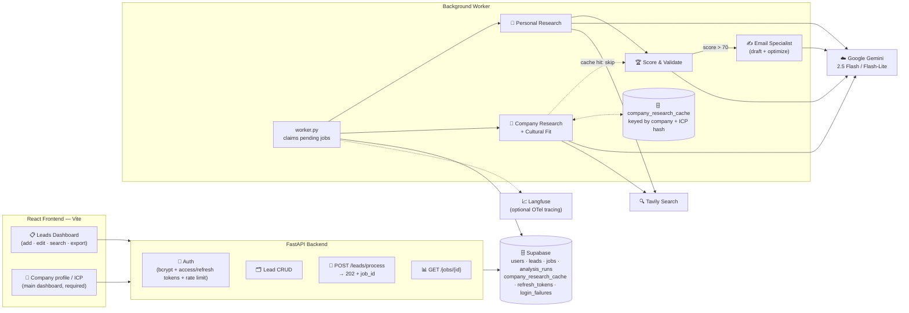

# Sales Pipeline — Lead Scoring & Email Generation

A full-stack, multi-agent sales pipeline application: a **React** dashboard backed by a **FastAPI** server that orchestrates **CrewAI** agent crews (powered by **Google Gemini**) to score sales leads and draft personalized outreach emails, with all data stored in **Supabase**.

---

## Features

- **Landing page** — Stripe-inspired marketing page with an animated product demo: the agent pipeline lights up in sequence, the score counts up, and the email draft types itself.
- **React dashboard** — add, view, edit, delete, search, and export leads; per-lead analysis modal with token/cost/timing breakdowns; charts (industry, source, score distribution, leads over time).
- **Required ICP** — your company profile & ideal customer profile live in a main-dashboard card and are required, not optional: processing a lead with none set pops a blocking dialog until you fill it in. No generic fallback exists.
- **Four-agent, three-crew pipeline** — a `company` crew (Company Research & Cultural Fit, cacheable), a `personal_scoring` crew (Personal Research → Lead Scoring & Validation), and an `email` crew (Email Specialist, draft + optimize) for leads scoring above 70.
- **Company research caching** — company facts + cultural fit are cached per (company, ICP) pair for repeat leads from the same company, with a short TTL (company status can change) and a **Force refresh** checkbox on the lead form to bypass it.
- **Web-search enrichment** — agents research leads live via **Tavily** search and website scraping.
- **Asynchronous job queue** — processing runs in a background worker; the API responds instantly and the UI polls job status, so long LLM runs never block requests.
- **Token-based auth** — signup/login with bcrypt password hashing; a short-lived 60-minute access token plus a revocable 14-day refresh token (stored server-side as a hash) that the frontend renews silently, so a session lasts without a hard hourly logout and logout revokes it server-side; every lead endpoint is ownership-checked; login is rate-limited (5 failed attempts → 15-minute lockout).
- **Operator-held API keys** — Gemini and Tavily keys are supplied once by the operator in `backend/.env`; end users never enter keys.
- **Editable & sendable email drafts** — click **Edit** on a lead's drafted email to revise it inline, or **Send** to deliver it through your own connected email account (per-user SMTP settings — a Gmail App Password or any SMTP provider; a daily cap guards the account).
- **Structured JSON logging** — every log line is correlated by `request_id`/`job_id`/`lead_id`, so one request's or job's full story is a single grep away.
- **Observability** — optional OpenTelemetry tracing of every crew/agent/LLM call via targeted openinference instrumentors, exported to Langfuse and/or Grafana Cloud (which also receives a `jobs_processed_total` metric powering no-activity/failure alerts), enabled automatically when the matching env vars are set.
- **YAML-driven agents** — all agent roles, task prompts, and workflow logic configurable in `backend/config/` without code changes.
- **Bulk CSV import** — add leads one at a time or upload a CSV; rows are validated per line, duplicates (by email) are skipped, and processing runs in batches of 10 with live progress.
- **Borderline scores are flagged, not hidden** — repeat scoring of the same lead varies by ~±3.5 points, so leads landing within 65–75 of the 70 email cutoff are badged **Borderline** with an explanation, rather than silently drafting (or not) on a coin flip.
- **Red-team test suite** — adversarial inputs (fake companies, prompt injection, contradictory data) with saved pass/fail reports.
- **Scoring evaluation harness** — reliability checks (repeatability, discrimination, seniority sensitivity, invariance) plus a human gold-set comparison for accuracy.

---

## Architecture


```mermaid
graph LR
    subgraph FE [React Frontend — Vite]
        UI["📋 Leads Dashboard<br>(add · edit · search · export)"]
        ICP["📝 Company profile / ICP<br>(main dashboard, required)"]
    end

    subgraph API [FastAPI Backend]
        Auth["🔐 Auth<br>(bcrypt + access/refresh tokens + rate limit)"]
        CRUD["🗂️ Lead CRUD"]
        Enq["📨 POST /leads/process<br>→ 202 + job_id"]
        Jobs["📊 GET /jobs/{id}"]
    end

    subgraph Worker [Background Worker]
        W["worker.py<br>claims pending jobs"]
        A1["🔎 Personal Research"] --> A3
        A2["🏢 Company Research<br>+ Cultural Fit"] -.->|cache hit: skip| A3["🏆 Score & Validate"]
        Cache[("🗄️ company_research_cache<br>keyed by company + ICP hash")]
        A2 <-.-> Cache
        A3 -->|score > 70| E1["✍️ Email Specialist<br>(draft + optimize)"]
        W --> A1 & A2
    end

    DB[("🗄️ Supabase<br>users · leads · jobs · analysis_runs<br>company_research_cache · refresh_tokens · login_failures")]
    LLM["☁️ Google Gemini<br>2.5 Flash / Flash-Lite"]
    Tavily["🔍 Tavily Search"]
    Trace["📈 Langfuse<br>(optional OTel tracing)"]

    UI --> API
    ICP --> API
    API --> DB
    W --> DB
    A1 & A2 & A3 & E1 --> LLM
    A1 & A2 --> Tavily
    W -.-> Trace
```

Three separate `Crew` objects (not one monolith), because `company` needs to be independently skippable on a cache hit:

| Crew | Agents | Runs when |
|---|---|---|
| `company` | Company Research & Cultural Fit Analyst (A2) | always, unless a fresh cache entry exists for `(company, ICP)` |
| `personal_scoring` | Personal Research Specialist (A1) → Lead Scorer & Validator (A3) | always |
| `email` | Email Specialist (E1) | only if the score from `personal_scoring` is > 70 |

## Project Structure

```
.
├── backend/
│   ├── backend.py            # FastAPI app: auth, lead CRUD, company profile, job enqueue/status
│   ├── worker.py             # Background job processor (runs the crews, company-research cache)
│   ├── pipeline.py           # CrewAI crews + process_leads entry point (no Supabase dependency)
│   ├── security.py           # bcrypt hashing + access/refresh session tokens
│   ├── logging_setup.py      # structured JSON logs + request/job/lead correlation IDs
│   ├── adversarial_testing.py # red-team test suite (needs backend/.venv — see below)
│   ├── scoring_eval.py       # Tier 1: scoring reliability (repeatability, sensitivity)
│   ├── scoring_gold_set.py   # Tier 2: agent vs human-scored gold set (accuracy)
│   ├── load_test.py          # worker drain + multi-worker safety (LLM stubbed); --calibrate for real cost
│   ├── load_test_api.py      # API latency, idle vs saturated worker (LLM stubbed)
│   ├── test_crews.py         # crew smoke test + CrewAI eval runs (needs backend/.venv — see below)
│   ├── requirements.txt      # pinned Python dependencies
│   └── config/               # agent & task YAML definitions (all three crews)
├── frontend/                 # React + Vite dashboard + landing page (Stripe-inspired design system)
└── tests/test_security.py    # no-network unit tests (run in CI)
```

---

## Setup

### 1. Supabase

Create a project at [supabase.com](https://supabase.com) with tables `users` (id, username, password, **company_context** text, plus **email_smtp_host** / **email_smtp_port** / **email_from_address** / **email_smtp_password** for per-user email sending), `leads` (including **email_sent_at**), and `analysis_runs`, plus:
- a `jobs` queue table (id, user_id, status, leads jsonb, gemini_api_key, tavily_api_key, results jsonb, error, created_at, **our_company_context** text, **force_refresh** boolean),
- a `company_research_cache` table (id, company_key **unique**, company_name, company_info jsonb, cultural_fit_score, cultural_fit_notes, cached_at) — the company-research cache, keyed by normalized company name + a hash of the ICP text; the unique constraint on `company_key` is also what makes the claim-before-research lock (see [Scaling notes](#scaling-notes)) atomic,
- a `login_failures` table (id, username, failed_at) — Supabase-backed login rate limiting,
- a `refresh_tokens` table (id, user_id, token_hash **unique**, expires_at, created_at) — server-side session refresh tokens, of which only a SHA-256 hash is stored,
- a unique constraint on `users.username`,
- indexes on `jobs(status, created_at)`, `leads(user_id)`, `analysis_runs(lead_id)`, `company_research_cache(company_key)`, `login_failures(username, failed_at)`, and `refresh_tokens(token_hash)`.

The exact DDL lives in a local `migrations.sql` (gitignored — it's operational, not source) that's kept up to date as the schema evolves; run it in the Supabase SQL editor. It's idempotent, so re-running it after a schema update only applies what changed.

> **Note on RLS:** the backend uses a service key, which bypasses Row Level Security; authorization is enforced at the API layer (token + ownership checks). Enabling RLS as a second layer is recommended for defense in depth.

### 2. Backend

```bash
cd backend
python -m venv .venv
.venv\Scripts\activate        # Windows
source .venv/bin/activate     # Linux/Mac
pip install -r requirements.txt
```

Create `backend/.env`:

```
SUPABASE_URL=your_supabase_url
SUPABASE_KEY=your_supabase_service_key
SECRET_KEY=any_long_random_string   # signs access tokens; required in production
GEMINI_API_KEY=your_gemini_key      # operator-held, powers all agents (required)
TAVILY_API_KEY=your_tavily_key      # operator-held, web-search enrichment (required)

# Optional — run the job worker inside the API process (single-service deploys)
RUN_WORKER_IN_PROCESS=1

# Optional — OpenTelemetry tracing of every crew/agent/LLM call, exported to
# Langfuse and/or Grafana Cloud (Grafana also gets the jobs_processed_total metric)
LANGFUSE_PUBLIC_KEY=
LANGFUSE_SECRET_KEY=
LANGFUSE_HOST=
GRAFANA_OTLP_ENDPOINT=
GRAFANA_OTLP_AUTH=

# Optional — daily per-user email send cap (default 80)
EMAIL_SEND_DAILY_CAP=80
```

Run the API and the worker (two terminals, from the repo root):

```bash
uvicorn backend.backend:app --host 0.0.0.0 --port 8000
python backend/worker.py
```

> **Single-process deploys (e.g. Render free tier):** instead of a separate
> worker service, set `RUN_WORKER_IN_PROCESS=1` on the web service — the job
> worker then runs as a background thread inside the API process. Switch back
> to a dedicated worker (and unset the flag) when you need more throughput.

### 3. Frontend

```bash
cd frontend
npm install
npm run dev        # http://localhost:5173 (expects the API on localhost:8000)
```

Set `VITE_BACKEND_URL` to point at a deployed backend in production builds.

### 4. API keys (operator-held)

Gemini and Tavily keys are provided once by the operator in `backend/.env` (`GEMINI_API_KEY` / `TAVILY_API_KEY`) — end users never enter keys, and the backend refuses to start without them:

- **Gemini** — [aistudio.google.com/app/apikey](https://aistudio.google.com/app/apikey) (powers all agents)
- **Tavily** — [app.tavily.com](https://app.tavily.com) (web-search enrichment)

---

## How to Use

1. **Get started from the landing page** — sign up or log in (username ≥ 3 chars, password ≥ 8 chars).
2. **Describe your company & ICP** in the main dashboard's Company Profile card and save it — this is what cultural-fit assessment and email drafting are measured against, and it's **required**: try to process a lead with it empty and a dialog blocks you until you fill it in (no generic fallback exists).
3. **(Optional) Connect your email** — in the **Email sending** card, add your from-address and an app password (a Gmail App Password, or any SMTP host/port) if you want to actually send drafts, not just view them.
4. **Add a lead** (name, company, email required) and click **Save & Process** — the lead is queued, the crews score it and (if it scores above 70) draft an email; the UI polls until the job completes. Check **Force refresh** first to bypass the company-research cache for that batch.
5. **Review results** — expand a lead card for the scoring breakdown and email draft; click **Edit** to revise the draft, or **Send** to email it (once your email account is connected). Open **📊 Analysis** for duration, token, and cost details (per-agent numbers are even-split estimates of the crew totals; a row marked **Cached** means company research was served from cache, **Skipped** means the email crew never ran because the score was ≤ 70 — both always listed at 0, so the breakdown always shows all 4 agents).
6. **Search / export** — filter the table and export the filtered set to CSV.

At most **10 leads** can be processed per request; job status is `pending → running → done | failed`.

---

## Scaling notes

- Lead processing is decoupled from HTTP via the `jobs` table. Each `worker.py` process runs up to `MAX_CONCURRENT_JOBS` (default 10) jobs concurrently via `asyncio` — unrelated users' jobs run in parallel, not queued behind each other one at a time. Add more `worker.py` processes to raise the ceiling further; running several is safe (load-tested), since a starting worker ages each `running` job against its own time budget instead of assuming everything in flight is abandoned. Requires the `started_at` column from `migrations.sql`.
- Access tokens are stateless (HMAC-signed) and refresh tokens live in the shared `refresh_tokens` table, so any API instance can serve or refresh any session — instances scale horizontally behind a load balancer; set the same `SECRET_KEY` on every one.
- The login rate limiter is Supabase-backed (`login_failures` table), not in-memory, so the lockout holds correctly across multiple API instances.
- Company research (facts + cultural fit) is cached per `(company, ICP)` pair — `COMPANY_CACHE_TTL_DAYS` (default 7) bounds how long a company shutting down / getting acquired could go undetected; `ProcessLeadsRequest.force_refresh` bypasses the cache for a batch, exposed in the UI as a **Force refresh** checkbox on the lead form.
- Concurrent requests for the same brand-new company don't duplicate the research: the first cache miss atomically claims the row (`company_key` is unique), so a second concurrent miss waits on the winner instead of re-running Tavily + Gemini itself.

---

## Testing & Evaluation

> **Run these with the backend virtualenv's Python, not your system Python** — they import `pipeline.py`, which needs crewai and friends installed only in `backend/.venv`. Either activate it first (`backend\.venv\Scripts\activate` on Windows) or invoke it directly (`backend\.venv\Scripts\python.exe backend\test_crews.py`). Both scripts detect the wrong interpreter and tell you the exact command to use instead of failing with a bare traceback.

- **Unit tests (no network):** `python tests/test_security.py` — also run in CI (`.github/workflows/ci.yml`) along with syntax checks, frontend lint, and build.
- **Crew smoke test + eval:** `python backend/test_crews.py` (needs `GEMINI_API_KEY`/`TAVILY_API_KEY`; makes real LLM calls).
- **Red teaming:** `python backend/adversarial_testing.py` runs adversarial leads (fake company, prompt injection, contradictory data, incomplete lead, biased framing, duplicates) and saves a report to `adversarial_results/` at the repo root. Latest run: **6/6 passed** — see `adversarial_results/run_2026-07-18_15-32-27.json`.

### Scoring evaluation

Two tiers, because "is the score stable?" and "is the score right?" are different questions — there's no point collecting human labels for a scorer that can't reproduce its own number.

**Tier 1 — reliability** (`python backend/scoring_eval.py`, reports in `scoring_eval_results/`). Scores 5 leads 10× each plus seniority/invariance probes, serving company research from cache so the variance measured is the scorer's rather than the web's. Use `--only <reliability|sensitivity|invariance>` to re-run one section. Latest run: **8/9 checks passed**:

| Check | Result |
|---|---|
| Reliability (5 leads × 10) | stdev **2.66–3.53** |
| Discriminant | **54-point** gap (worst strong 85 vs best weak 31) |
| Sensitivity (seniority) | CTO **90.2** → Intern **65.2** = **−25.0**, no overlap |
| Invariance (cosmetic) | **3.1** points drift |
| Threshold stability | **failed** — a lead at mean 72.1 (range 67–80) drafted an email on 8 of 10 identical runs |

That last one is why leads scoring 65–75 are badged **Borderline** in the UI: a hard cutoff sits on a score with ~±3.5 noise, so the honest fix is to say so rather than move the line. (Raising the threshold to 80 was measured and rejected — on the real distribution it barely changes who qualifies, 93% → 89%, while taking leads-near-the-edge from 0 to 8.)

**Tier 2 — accuracy** (`python backend/scoring_gold_set.py`). `--export` writes a blind template (lead details, no agent score, spread evenly across the score range); hand-score each 0–100; `--compare <file>` reports MAE, mean signed error, % within 10, Spearman rank correlation, and the 70-threshold confusion matrix. `--compare <file> --rescore` re-runs the pipeline against the currently saved ICP **without touching stored lead scores**, so a prompt or rubric change can be measured against the same gold set as an experiment rather than a mutation.

Run against 20 hand-scored leads, the scorer was **systematically inflated and mis-ordered**: MAE 33.0, mean signed error **+33.0** (higher than the human on every lead), **Spearman −0.07**, and 11 leads emailed that the human would not have contacted. Near-zero rank correlation was the serious half — pure inflation can be recalibrated away, but disagreeing on the *ordering* cannot.

The cause was a missing **build-vs-buy** notion. Splitting the gold set by "does this company already ship its own agent platform" was decisive: such companies scored **+57.6** over the human, everyone else **+12.9 with Spearman +0.70**. Company size was never the problem — mega-caps that *don't* build agent platforms were already near-perfect (JPMorgan +7, HSBC +1, Shopify +3).

Fixing the **ICP text** — dropping the "Enterprise" size framing and adding an explicit anti-ICP disqualifier — moved it to **MAE 20.05, bias +14.75, Spearman +0.61, 4 false positives**. That configuration is what's live.

A follow-up attempt to enforce the same idea *structurally* (a researched `has_competing_solution` flag plus a hard score cap) was built, measured, and **reverted**: MAE rose to 22.60 and Spearman fell to 0.43, because the flag fired on 11 of 20 leads and pinned them all at the cap — destroying ranking information while missing the actual builders. Prompt-level framing beat structural enforcement here.

Limits worth quoting alongside every number above: a single rater (agreement with that person, not truth), imperfect blinding for leads already seen in the app, n=20, and the scorer's own ~±3.5-point run-to-run noise, so small differences aren't signal.

### Load testing

Pointing a load tool at `POST /leads/process` would measure how fast Supabase inserts a row — a queue's whole job is absorbing load, so that number is large and meaningless. Instead the LLM is stubbed at the pipeline boundary and the parts we actually own are tested: job claiming, concurrency bounding, queue wait, multi-worker safety, and API latency. That costs nothing and runs in minutes, versus ~6 hours and ~$11 to drain 400 leads for real.

**Worker drain** (`python backend/load_test.py --jobs 40 --workers 2`, reports in `load_test_results/`). Seeds real job rows and spawns real worker processes; only `process_leads` and `persist_results` are stubbed, so cross-process claim contention is genuine. It refuses to start if real jobs are pending, and cleans up after itself.

This found the one critical bug: `fail_stale_running_jobs()` marked **every** `running` job failed on startup with no worker filter, so a second worker booting destroyed the first worker's in-flight work — measured **0 done / 4 failed**. Fixed with a `started_at` column and a per-job time budget (`PIPELINE_TIMEOUT_S × lead count × 3`) so only genuinely abandoned jobs are reaped; the same test now gives **4 done / 0 failed**. Claim round trip is 576ms and 31% of contested claims lose the race, both left alone deliberately — filling 10 slots costs ~5.9s against ~520s of real work per job.

**API under saturation** (`python backend/load_test_api.py`). Compares latency with an idle queue against a fully saturated worker, 20 concurrent clients:

| Endpoint | idle p95 | saturated p95 | |
|---|---|---|---|
| `GET /` | 31ms | 32ms | ×1.0 |
| `GET /leads` | 906ms | 1094ms | ×1.2 |
| `GET /jobs` | 718ms | 719ms | ×1.0 |
| `POST /auth/login` | 2391ms | 2484ms | ×1.0 |

So `RUN_WORKER_IN_PROCESS=1` is safe under load — the in-process worker gets its own thread and event loop, and the work is I/O-bound. This run also caught a bug unrelated to the worker: 15–20% of requests were returning 500 from `httpx.RemoteProtocolError("Server disconnected")`, PostgREST closing idle keep-alive connections that httpx only discovers on reuse. It clustered *after idle periods* rather than under load. Fixed with a transport that replays once for `GET`/`HEAD`/`OPTIONS` only — a stale connection is indistinguishable from a lost response, so POSTs must never replay — taking errors from 46–76 per run to **0 across ~2,700 requests**, with throughput up ~29%.

**Real-cost calibration** (`python backend/load_test.py --calibrate 5`) is the only part that spends money (~$0.03/lead). It validates the stub's timing model against reality and corrected two figures: real cost is **$0.029/lead uncached**, and real time is **~52s/lead in a batch**, not the ~106s assumed from stored runs — because `analysis_runs.duration_seconds` records the whole *job's* elapsed time on every lead, not per-lead time. Corrected capacity: **~700 leads/hour per worker**, before Gemini quota.

Everything above was measured locally. Instance size, proxy timeouts and cold starts are platform questions a local run can't answer, so a smaller confirmation run against Render is still worth doing.

### Evaluation Results

The pipeline was evaluated with CrewAI's built-in evaluation framework (`backend/test_crews.py`, LLM-as-judge, no human baseline yet) across **two independent runs per crew** — one table per crew, since `crew.test()` evaluates a single `Crew` object at a time and, per the [Architecture](#architecture) above, there are three: `company`, `personal_scoring`, `email`.

#### 🏢 Company Crew — Avg Score: **10.0 / 10** *(~21s execution)*


- **Company Research & Cultural Fit Analyst**: 10.0 in both runs

#### 🔎 Personal Research + Scoring Crew — Avg Score: **10.0 / 10** *(~20s execution)*


- **Personal Research Specialist**: 10.0 in both runs
- **Lead Scorer and Validator**: 10.0 in both runs

#### ✍️ Email Crew — Avg Score: **9.5 / 10** *(~11s execution)*


- **Email Specialist**: 10.0 / 9.0 across runs (avg 9.5)

> These are LLM-as-judge scores for **output quality** — whether each crew's report is well-formed and on-task. They say nothing about whether a *lead score is correct*; that's what the two-tier scoring evaluation below measures.

---

## Troubleshooting

- **"Missing authentication token" / session expired** — the 60-minute access token is normally refreshed silently in the background; you'll only be sent back to login once the 14-day refresh token has expired or been revoked (e.g. after logout).
- **Job stuck in `pending`** — the worker isn't running; start `python backend/worker.py`.
- **Supabase errors on startup** — the backend refuses to start without `SUPABASE_URL`/`SUPABASE_KEY` in `backend/.env`.
- **429 on login** — five failed attempts triggers a 15-minute lockout for that username.
- **`column users.company_context does not exist` (or similar `42703` errors)** — the schema migration hasn't been applied yet; run the latest `migrations.sql` in the Supabase SQL editor.
