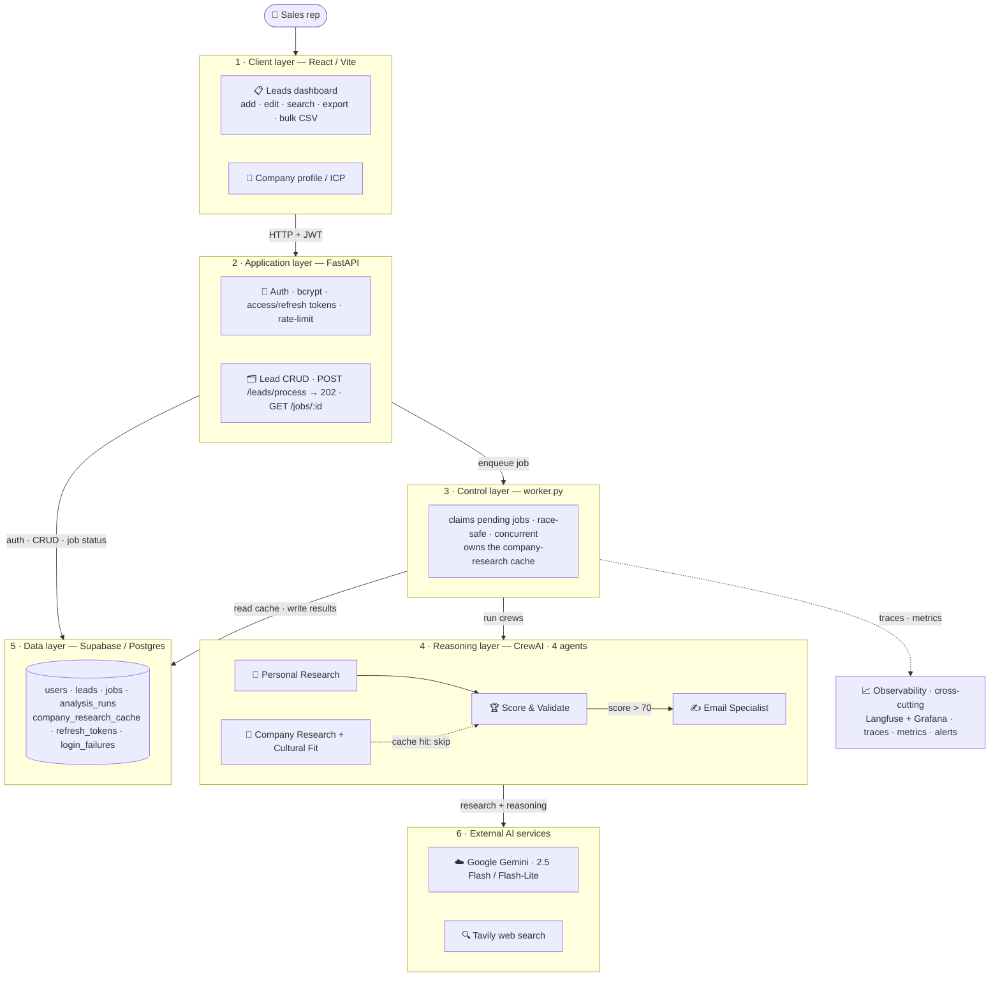

# Sales Pipeline — Lead Scoring & Email Generation

A full-stack, multi-agent sales pipeline application: a **React** dashboard backed by a **FastAPI** server that orchestrates **CrewAI** agent crews (powered by **Google Gemini**) to score sales leads and draft personalized outreach emails, with all data stored in **Supabase**.

---

## Features

- **Landing page** — Stripe-inspired marketing page with an animated product demo: the agent pipeline lights up in sequence, the score counts up, and the email draft types itself.
- **React dashboard** — a menu (top-right) switches between pages: **Add a lead**, **Dashboard** (charts — industry, source, score distribution, leads over time), **Lead details** (search, edit, delete, export; per-lead analysis modal with token/cost/timing breakdowns), and **Settings** (company & ICP, email sending). The menu also shows the signed-in account and Log out.
- **Required ICP** — your company profile & ideal customer profile live in a main-dashboard card and are required, not optional: processing a lead with none set pops a blocking dialog until you fill it in. No generic fallback exists. The placeholder guides you to write not just a strong-fit ICP but explicit **Weak fit** and **Not a fit** lines — spelling those out is what the scoring evaluation showed makes the score trustworthy.
- **Four-agent, three-crew pipeline** — a `company` crew (Company Research & Cultural Fit, cacheable), a `personal_scoring` crew (Personal Research → Lead Scoring & Validation), and an `email` crew (Email Specialist, draft + optimize) for leads scoring above 70.
- **Company research caching** — company facts + cultural fit are cached per (company, ICP) pair for repeat leads from the same company, with a short TTL (company status can change) and a **Force refresh** checkbox on the lead form to bypass it.
- **Web-search enrichment** — agents research leads live via **Tavily** search and website scraping.
- **Asynchronous job queue** — processing runs in a background worker; the API responds instantly and the UI polls job status, so long LLM runs never block requests.
- **Live per-agent progress** — while a lead is processing, a progress bar and step list below the form show which agent is working: Company research & cultural fit → Personal research → Lead scoring → Email draft. Each step ticks over as that agent's task actually completes (the worker publishes stages to `jobs.progress`), so it reflects real pipeline state rather than an animated guess — including **cached** when company research was skipped.
- **Token-based auth** — signup/login with bcrypt password hashing (signing up logs you straight in, no second login step); a short-lived 60-minute access token plus a revocable 14-day refresh token (stored server-side as a hash) that the frontend renews silently, so a session lasts without a hard hourly logout and logout revokes it server-side; every lead endpoint is ownership-checked; login is rate-limited (5 failed attempts → 15-minute lockout) and signups are capped per IP (10 accounts/hour) so nobody farms daily credits by scripting throwaway accounts.
- **Operator-held API keys** — Gemini and Tavily keys are supplied once by the operator in `backend/.env`; end users never enter keys.
- **Daily lead credits** — since the keys are operator-held, every processed lead is the operator's LLM spend on one shared quota, so each account gets a daily allowance set by `DAILY_LEAD_CAP` (1 credit = 1 lead). It's required with no default: a deploy that forgets it fails at startup rather than silently running on a guessed spend limit. The dashboard shows credits remaining, over-limit requests are rejected before any spend, and the count resets at UTC midnight — no credits table or reset job, since "remaining" is just `cap − leads-processed-today`.
- **Editable & sendable email drafts** — click **Edit** on a lead's drafted email to revise it inline, or **Send** to deliver it through your own connected email account (per-user SMTP settings — a Gmail App Password or any SMTP provider; a daily cap guards the account).
- **Structured JSON logging** — every log line is correlated by `request_id`/`job_id`/`lead_id`, so one request's or job's full story is a single grep away.
- **Observability** — optional OpenTelemetry tracing of every crew/agent/LLM call via targeted openinference instrumentors, exported to Langfuse and/or Grafana Cloud (which also receives a `jobs_processed_total` metric powering no-activity/failure alerts), enabled automatically when the matching env vars are set.
- **YAML-driven agents** — all agent roles, task prompts, and workflow logic configurable in `backend/config/` without code changes.
- **Bulk CSV import** — add leads one at a time or upload a CSV; rows are validated per line and duplicates (by email) are skipped. An import must fit the day's remaining credits: uploading more leads than credits left is blocked upfront with a "upload at most N" message, rather than partially processing. During a run each lead is scored one at a time with a live per-lead list (queued / scoring… / scored / failed), so the team watches them complete one after another.
- **Borderline scores are flagged, not hidden** — repeat scoring of the same lead varies by ~±3.5 points, so leads landing within 65–75 of the 70 email cutoff are badged **Borderline** with an explanation, rather than silently drafting (or not) on a coin flip.
- **Red-team test suite** — adversarial inputs (fake companies, prompt injection, contradictory data) with saved pass/fail reports.
- **Scoring evaluation harness** — reliability checks (repeatability, discrimination, seniority sensitivity, invariance) plus a human gold-set comparison for accuracy.

---

## Architecture

Six layers, read top to bottom. Each arrow is a hand-off between layers — the shared services (data, external AI) are reached once per layer rather than by every agent, so the flow stays legible.


```mermaid
graph TD
    User(["👤 Sales rep"])

    subgraph CLIENT ["1 · Client layer — React / Vite"]
        UI["📋 Leads dashboard<br>add · edit · search · export · bulk CSV"]
        ICP["📝 Company profile / ICP"]
    end

    subgraph APP ["2 · Application layer — FastAPI"]
        Auth["🔐 Auth · bcrypt · access/refresh tokens · rate-limit"]
        REST["🗂️ Lead CRUD · POST /leads/process → 202 · GET /jobs/:id"]
    end

    subgraph CTRL ["3 · Control layer — worker.py"]
        Claim["claims pending jobs · race-safe · concurrent<br>owns the company-research cache"]
    end

    subgraph AI ["4 · Reasoning layer — CrewAI · 4 agents"]
        A1["🔎 Personal Research"] --> A3["🏆 Score &amp; Validate"]
        A2["🏢 Company Research + Cultural Fit"] -.->|cache hit: skip| A3
        A3 -->|score &gt; 70| E1["✍️ Email Specialist"]
    end

    subgraph DATA ["5 · Data layer — Supabase / Postgres"]
        Tbls[("users · leads · jobs · analysis_runs<br>company_research_cache · refresh_tokens · login_failures")]
    end

    subgraph EXT ["6 · External AI services"]
        LLM["☁️ Google Gemini · 2.5 Flash / Flash-Lite"]
        Tavily["🔍 Tavily web search"]
    end

    OBS["📈 Observability · cross-cutting<br>Langfuse + Grafana · traces · metrics · alerts"]

    User --> CLIENT
    CLIENT -->|HTTP + JWT| APP
    APP -->|auth · CRUD · job status| DATA
    APP -->|enqueue job| CTRL
    CTRL -->|run crews| AI
    AI -->|research + reasoning| EXT
    CTRL -->|read cache · write results| DATA
    CTRL -.->|traces · metrics| OBS
```

Three separate `Crew` objects (not one monolith), because `company` needs to be independently skippable on a cache hit:

| Crew | Agents | Runs when |
|---|---|---|
| `company` | Company Research & Cultural Fit Analyst (A2) | always, unless a fresh cache entry exists for `(company, ICP)` |
| `personal_scoring` | Personal Research Specialist (A1) → Lead Scorer & Validator (A3) | always |
| `email` | Email Specialist (E1) | only if the score from `personal_scoring` is > 70 |

## Project Structure

```
.
├── backend/
│   ├── backend.py            # FastAPI app: auth, lead CRUD, company profile, job enqueue/status
│   ├── worker.py             # Background job processor (runs the crews, company-research cache)
│   ├── pipeline.py           # CrewAI crews + process_leads entry point (no Supabase dependency)
│   ├── security.py           # bcrypt hashing + access/refresh session tokens
│   ├── logging_setup.py      # structured JSON logs + request/job/lead correlation IDs
│   ├── adversarial_testing.py # red-team test suite (needs backend/.venv — see below)
│   ├── scoring_eval.py       # Tier 1: scoring reliability (repeatability, sensitivity)
│   ├── scoring_gold_set.py   # Tier 2: agent vs human-scored gold set (accuracy)
│   ├── load_test.py          # worker drain + multi-worker safety (LLM stubbed); --calibrate for real cost
│   ├── load_test_api.py      # API latency, idle vs saturated worker (LLM stubbed)
│   ├── test_crews.py         # crew smoke test + CrewAI eval runs (needs backend/.venv — see below)
│   ├── Dockerfile            # one image, two commands (API via uvicorn, worker via python)
│   ├── requirements.txt      # pinned Python dependencies
│   └── config/               # agent & task YAML definitions (all three crews)
├── frontend/                 # React + Vite dashboard + landing page (Stripe-inspired design system)
│   ├── src/csv.js            # CSV import parser (bulk import)
│   ├── src/csv.test.js       # 18 node:test checks for the parser (run in CI)
│   ├── Dockerfile            # node build → nginx static serve
│   └── nginx.conf            # SPA fallback + fingerprinted-asset caching
├── tests/test_security.py    # no-network unit tests (run in CI)
├── .github/workflows/ci.yml  # lint + tests + docker build + gated deploy
├── docker-compose.yml        # local stack: api + worker + frontend
└── ruff.toml                 # Python lint config
```

---

## Setup

### 1. Supabase

Create a project at [supabase.com](https://supabase.com) with tables `users` (id, username, password, **company_context** text, plus **email_smtp_host** / **email_smtp_port** / **email_from_address** / **email_smtp_password** for per-user email sending), `leads` (including **email_sent_at**), and `analysis_runs`, plus:
- a `jobs` queue table (id, user_id, status, leads jsonb, gemini_api_key, tavily_api_key, results jsonb, error, created_at, **our_company_context** text, **force_refresh** boolean, **progress** jsonb — the live per-agent stage map the UI renders while a lead is processing),
- a `company_research_cache` table (id, company_key **unique**, company_name, company_info jsonb, cultural_fit_score, cultural_fit_notes, cached_at) — the company-research cache, keyed by normalized company name + a hash of the ICP text; the unique constraint on `company_key` is also what makes the claim-before-research lock (see [Scaling notes](#scaling-notes)) atomic,
- a `login_failures` table (id, username, failed_at) — Supabase-backed login rate limiting,
- a `signup_attempts` table (id, ip, created_at) — Supabase-backed per-IP signup rate limiting (one row per created account),
- a `refresh_tokens` table (id, user_id, token_hash **unique**, expires_at, created_at) — server-side session refresh tokens, of which only a SHA-256 hash is stored,
- a unique constraint on `users.username`,
- indexes on `jobs(status, created_at)`, `leads(user_id)`, `analysis_runs(lead_id)`, `company_research_cache(company_key)`, `login_failures(username, failed_at)`, `signup_attempts(ip, created_at)`, and `refresh_tokens(token_hash)`.

The exact DDL lives in a local `migrations.sql` (gitignored — it's operational, not source) that's kept up to date as the schema evolves; run it in the Supabase SQL editor. It's idempotent, so re-running it after a schema update only applies what changed.

> **Note on RLS:** the backend uses a service key, which bypasses Row Level Security; authorization is enforced at the API layer (token + ownership checks). Enabling RLS as a second layer is recommended for defense in depth.

### 2. Backend

```bash
cd backend
python -m venv .venv
.venv\Scripts\activate        # Windows
source .venv/bin/activate     # Linux/Mac
pip install -r requirements.txt
```

Create `backend/.env`:

```
SUPABASE_URL=your_supabase_url
SUPABASE_KEY=your_supabase_service_key
SECRET_KEY=any_long_random_string   # signs access tokens; required in production
GEMINI_API_KEY=your_gemini_key      # operator-held, powers all agents (required)
TAVILY_API_KEY=your_tavily_key      # operator-held, web-search enrichment (required)
DAILY_LEAD_CAP=5                    # leads each account may process per day (required)

# Optional — run the job worker inside the API process (single-service deploys)
RUN_WORKER_IN_PROCESS=1

# Optional — OpenTelemetry tracing of every crew/agent/LLM call, exported to
# Langfuse and/or Grafana Cloud (Grafana also gets the jobs_processed_total metric)
LANGFUSE_PUBLIC_KEY=
LANGFUSE_SECRET_KEY=
LANGFUSE_HOST=
GRAFANA_OTLP_ENDPOINT=
GRAFANA_OTLP_AUTH=

# Optional — daily per-user email send cap (default 80)
EMAIL_SEND_DAILY_CAP=80
```

Run the API and the worker (two terminals, from the repo root):

```bash
uvicorn backend.backend:app --host 0.0.0.0 --port 8000
python backend/worker.py
```

> **Single-process deploys (e.g. Render free tier):** instead of a separate
> worker service, set `RUN_WORKER_IN_PROCESS=1` on the web service — the job
> worker then runs as a background thread inside the API process. Switch back
> to a dedicated worker (and unset the flag) when you need more throughput.

### 3. Frontend

```bash
cd frontend
npm install
npm run dev        # http://localhost:5173 (expects the API on localhost:8000)
```

Set `VITE_BACKEND_URL` to point at a deployed backend in production builds. Vite inlines env vars at **build** time, so this must be set when the bundle is built, not when it's served.

### 4. Docker (optional)

The whole stack runs in containers — Supabase stays remote (it's the system of record), so `backend/.env` must point at a real project:

```bash
docker compose up --build
# frontend → http://localhost:5173   API → http://localhost:8000
```

Three services: `api` (uvicorn), `worker` (`python backend/worker.py`), and `frontend` (Vite build served by nginx). API and worker share one image — same dependencies, different start command. They run as separate services rather than via `RUN_WORKER_IN_PROCESS`, which is the shape the [load tests](#load-testing) validated; `docker compose up --scale worker=3` is safe now that jobs carry `started_at`. Both backend containers run non-root with a healthcheck on `GET /`.

### 5. API keys (operator-held)

Gemini and Tavily keys are provided once by the operator in `backend/.env` (`GEMINI_API_KEY` / `TAVILY_API_KEY`) — end users never enter keys, and the backend refuses to start without them:

- **Gemini** — [aistudio.google.com/app/apikey](https://aistudio.google.com/app/apikey) (powers all agents)
- **Tavily** — [app.tavily.com](https://app.tavily.com) (web-search enrichment)

---

## How to Use

1. **Get started from the landing page** — sign up (which drops you straight into the app) or log in (username ≥ 3 chars, password ≥ 8 chars).
2. **Describe your company & ICP** in the main dashboard's Company Profile card and save it — this is what cultural-fit assessment and email drafting are measured against, and it's **required**: try to process a lead with it empty and a dialog blocks you until you fill it in (no generic fallback exists).
3. **(Optional) Connect your email** — in the **Email sending** card, add your from-address and an app password (a Gmail App Password, or any SMTP host/port) if you want to actually send drafts, not just view them.
4. **Add a lead** (name, company, email required) and click **Save & Process** — the lead is queued, the crews score it and (if it scores above 70) draft an email. A progress bar and step list appear below the form and advance as each agent finishes, so you can see which one is working. Check **Force refresh** first to bypass the company-research cache for that batch.
5. **Review results** — expand a lead card for the scoring breakdown and email draft; click **Edit** to revise the draft, or **Send** to email it (once your email account is connected). Open **📊 Analysis** for duration, token, and cost details (per-agent numbers are even-split estimates of the crew totals; a row marked **Cached** means company research was served from cache, **Skipped** means the email crew never ran because the score was ≤ 70 — both always listed at 0, so the breakdown always shows all 4 agents).
6. **Search / export** — filter the table and export the filtered set to CSV.

Processing is capped per account per day by `DAILY_LEAD_CAP` (the daily credit allowance); job status is `pending → running → done | failed`.

---

## Scaling notes

- Lead processing is decoupled from HTTP via the `jobs` table. Each `worker.py` process runs up to `MAX_CONCURRENT_JOBS` (default 10) jobs concurrently via `asyncio` — unrelated users' jobs run in parallel, not queued behind each other one at a time. Add more `worker.py` processes to raise the ceiling further; running several is safe (load-tested), since a starting worker ages each `running` job against its own time budget instead of assuming everything in flight is abandoned. Requires the `started_at` column from `migrations.sql`.
- Access tokens are stateless (HMAC-signed) and refresh tokens live in the shared `refresh_tokens` table, so any API instance can serve or refresh any session — instances scale horizontally behind a load balancer; set the same `SECRET_KEY` on every one.
- Both rate limiters are Supabase-backed, not in-memory, so they hold correctly across multiple API instances: login (`login_failures`, per username) and signup (`signup_attempts`, per IP). The signup cap (`SIGNUP_MAX_PER_IP`/`SIGNUP_WINDOW_S`, default 10/hour) counts one row per created account, so a spammer can't mint accounts to farm each one's daily credits.
- Company research (facts + cultural fit) is cached per `(company, ICP)` pair — `COMPANY_CACHE_TTL_DAYS` (default 7) bounds how long a company shutting down / getting acquired could go undetected; `ProcessLeadsRequest.force_refresh` bypasses the cache for a batch, exposed in the UI as a **Force refresh** checkbox on the lead form.
- Concurrent requests for the same brand-new company don't duplicate the research: the first cache miss atomically claims the row (`company_key` is unique), so a second concurrent miss waits on the winner instead of re-running Tavily + Gemini itself.
- `GET /leads` returns only the columns the list renders. `scoring_result` and `email_draft` are ~78% of a lead row but are only shown once a card is expanded, so they come from `GET /leads/{lead_id}/detail` on demand — measured **~100KB → 15.8KB** for a 50-lead account on the most-requested endpoint. Trade-off: search no longer matches text *inside* drafts or scoring JSON (server-side search would be the fix if that's ever wanted).
- Every route in `backend.py` is a sync `def`, so FastAPI runs each in a worker thread — anyio caps that pool at 40 by default, which is the first ceiling under load. The two hottest read endpoints (`GET /leads`, `GET /jobs/{id}`) use a genuinely async Supabase client instead, so they suspend on I/O rather than holding a thread. Converting more routes means converting *every* blocking call inside them too; a half-converted `async def` blocks the whole event loop, which is worse than leaving it sync.

---


## Testing & Evaluation

> Run these with the backend virtualenv (`backend\.venv\Scripts\python.exe ...`), not system Python — they import `pipeline.py`. Each script detects the wrong interpreter and prints the right command.

| What | Command | Runs in CI |
|---|---|---|
| Unit tests (no network) | `python tests/test_security.py` | ✅ |
| CSV parser (18 checks) | `cd frontend && npm test` | ✅ |
| Lint | `ruff check backend/ tests/` · `npm run lint` | ✅ |
| Crew smoke test | `python backend/test_crews.py` | — (real LLM calls) |
| Red teaming | `python backend/adversarial_testing.py` | — (real LLM calls) |

Red teaming covers fake companies, prompt injection, contradictory data and biased framing. Latest: **6/6 passed** (`adversarial_results/`).

### Scoring evaluation

Two tiers, because "is the score stable?" and "is the score right?" are different questions.

**Tier 1 — reliability** (`python backend/scoring_eval.py`): 5 leads × 10 runs plus sensitivity/invariance probes, company research served from cache so the variance measured is the scorer's, not the web's. **8/9 passed** — stdev 2.66–3.53, a 54-point discriminant gap, seniority sensitivity −25.0.

The one failure is structural: a hard cutoff at 70 sits on a score with ~±3.5 run-to-run noise, so a lead at mean 72.1 drafted an email on 8 of 10 identical runs. Handled by badging 65–75 as **Borderline** in the UI rather than moving the line — raising the threshold to 80 was measured and made it worse (leads-near-the-edge 0 → 8).

**Tier 2 — accuracy** (`python backend/scoring_gold_set.py`): `--export` writes a blind template, you hand-score 0–100, `--compare` reports MAE / bias / Spearman / confusion matrix. `--rescore` re-runs the pipeline against the current ICP without touching stored scores, so a prompt change can be measured as an experiment.

Against 20 hand-scored leads the scorer was inflated **and** mis-ordered — MAE 33.0, bias +33.0, Spearman −0.07. Mis-ordering was the serious half: inflation can be recalibrated, disagreement about ranking cannot.

The cause was a missing **build-vs-buy** notion. Companies that ship their own agent platform scored **+57.6** over the human; everyone else **+12.9 with Spearman +0.70**. Size was never the issue (JPMorgan +7, HSBC +1, Shopify +3). Rewriting the ICP text alone — dropping the "Enterprise" framing, adding an explicit anti-ICP disqualifier — reached **MAE 20.05, Spearman +0.61**, which is what's live. Enforcing the same idea *structurally* (a `has_competing_solution` flag with a hard cap) measured worse and was reverted.

> **Limits:** one rater, n=20, imperfect blinding, and ~±3.5 points of scorer noise. Small differences aren't signal.

### Load testing

Pointing a load tool at `POST /leads/process` would measure how fast Supabase inserts a row — absorbing load is the queue's whole job. So the LLM is stubbed at the pipeline boundary and the parts we own get tested instead: job claiming, concurrency, and API latency. Free, and minutes instead of the ~6 hours and ~$11 a real 400-lead drain would cost.

**Worker drain** (`python backend/load_test.py --jobs 40 --workers 2`) — real job rows, real worker processes, only the LLM stubbed. Found the one critical bug: `fail_stale_running_jobs()` failed *every* running job on startup, so a second worker booting destroyed the first one's in-flight work (**0 done / 4 failed**). Fixed with a `started_at` lease; same test now **4 done / 0 failed**.

**API concurrency** (`python backend/load_test_api.py --ramp --mix read --seed-leads 50`) — ramps concurrent users to find where it breaks. Against the deployed free tier (512MB / 0.1 vCPU):

| Concurrent users | Throughput | p95 | Errors |
|---|---|---|---|
| 10 | 28 req/s | 532ms | 0% |
| 25 | 35 req/s | 1.1s | 0% |
| 50 | 35 req/s | 2.9s | 0% |
| 100 | 27 req/s | 7.8s | 0% |

**Zero errors to 100 concurrent users** — past ~25 it queues rather than fails. Those are clients hammering with no think time; real users pause between clicks, so 50 real users generate well under the sustained throughput. Two fixes came out of this: trimming the leads payload (~84% smaller, see [Scaling notes](#scaling-notes)) and a transport that retries connections PostgREST closed while idle, which had been causing 15–20% of requests to 500.

**Real-cost calibration** (`python backend/load_test.py --calibrate 5`) is the only part that spends money (~$0.03/lead). It corrected two figures: **$0.029/lead** uncached and **~52s/lead** in a batch — not the ~106s assumed, because `analysis_runs.duration_seconds` stores the whole *job's* time on every lead. Corrected capacity: **~700 leads/hour per worker**.


## CI/CD

`.github/workflows/ci.yml` runs on every push and pull request, as four jobs:

| Job | Does |
|---|---|
| `backend` | `ruff` lint · `py_compile` all of `backend/*.py` + `tests/*.py` · no-network security unit tests |
| `frontend` | `eslint` · `npm test` (18 CSV-parser checks) · `vite build` |
| `docker` | builds both images (no push) — where the Dockerfiles are actually verified |
| `deploy` | POSTs the Render deploy hooks — gated on the three jobs above **and** a push to `main` |

**Deploy is gated on green, by design.** The `deploy` job fires the [Render deploy hooks](https://render.com/docs/deploy-hooks) only after tests pass, so a failing build can't ship. For that to hold, turn **off** Render's own auto-deploy-on-push (otherwise Render deploys instantly on push, before CI has judged the code) and add two repo secrets:

- `RENDER_DEPLOY_HOOK_BACKEND`
- `RENDER_DEPLOY_HOOK_FRONTEND`

Without those secrets the `deploy` job skips cleanly with a message rather than failing, so CI is useful before deployment is wired up — you just don't get the "red build can't ship" guarantee until both are set.

---

## Troubleshooting

- **"Missing authentication token" / session expired** — the 60-minute access token is normally refreshed silently in the background; you'll only be sent back to login once the 14-day refresh token has expired or been revoked (e.g. after logout).
- **Job stuck in `pending`** — the worker isn't running; start `python backend/worker.py`.
- **Supabase errors on startup** — the backend refuses to start without `SUPABASE_URL`/`SUPABASE_KEY` in `backend/.env`.
- **429 on login** — five failed attempts triggers a 15-minute lockout for that username.
- **429 on signup** — one IP hit the signup cap (default 10 accounts/hour); tune with `SIGNUP_MAX_PER_IP`/`SIGNUP_WINDOW_S`, or wait out the window.
- **`column users.company_context does not exist` (or similar `42703` errors)** — the schema migration hasn't been applied yet; run the latest `migrations.sql` in the Supabase SQL editor.
