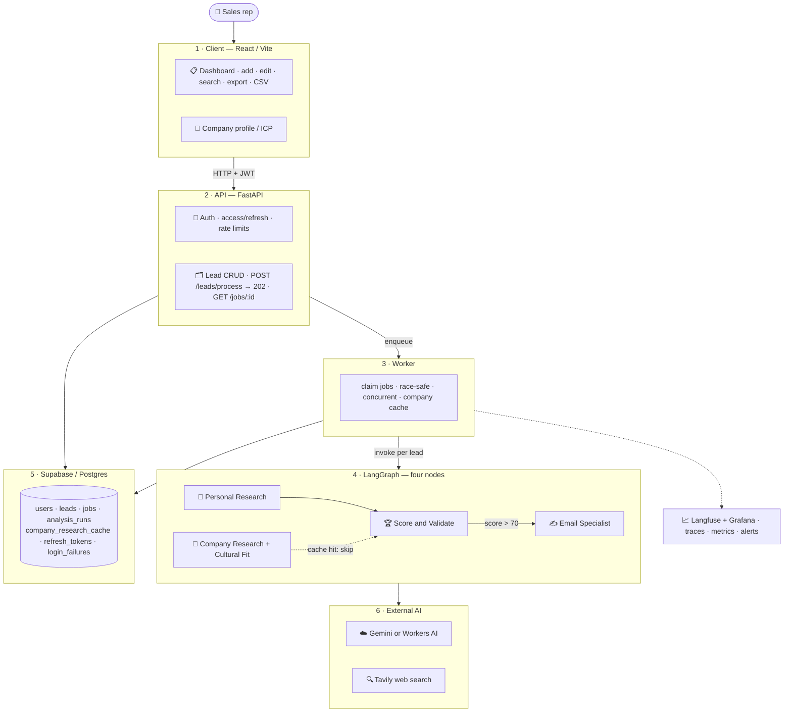

# Sales Pipeline — Lead Scoring & Email Generation

Multi-agent sales pipeline: **React** dashboard → **FastAPI** → **LangGraph** agents (Google Gemini or Cloudflare Workers AI) → **Supabase**. The graph researches and scores leads; those above 70 receive a personalized outreach draft.

---

## Features

- **Four-node LangGraph pipeline** — company research → personal research → scoring → conditional email generation
- **Required ICP** — processing is blocked until a company profile and ideal customer profile are saved
- **Company cache** — keyed by `(company, ICP)` with a TTL, atomic claim, and force-refresh option
- **Async job queue** — `POST /leads/process` returns `202`; workers process jobs concurrently while the UI reports live per-agent progress
- **Reliable execution** — idempotent submissions, tenant-fair job claims, targeted retries, graceful shutdown, optional provider failover, and a circuit breaker
- **Bounded, visible spend** — operator-held keys, required `DAILY_LEAD_CAP`, and per-agent token/cost/timing details
- **Secure accounts** — bcrypt, 60-minute access tokens, rotating 14-day refresh tokens, ownership checks, and distributed login/signup rate limits
- **React dashboard** — charts, search, CSV import/export, analysis detail, editable drafts, and SMTP sending
- **Borderline flagging** — scores from 65–75 are marked **Borderline** because repeat scoring varies about ±3.5 points near the threshold
- **Observability and evaluation** — structured correlated logs, optional OpenTelemetry to Langfuse/Grafana, red-team tests, and a 50-lead evaluation suite

## Architecture


```mermaid
graph TD
    User(["👤 Sales rep"])

    subgraph CLIENT ["1 · Client — React / Vite"]
        UI["📋 Dashboard · add · edit · search · export · CSV"]
        ICP["📝 Company profile / ICP"]
    end

    subgraph APP ["2 · API — FastAPI"]
        Auth["🔐 Auth · access/refresh · rate limits"]
        REST["🗂️ Lead CRUD · POST /leads/process → 202 · GET /jobs/:id"]
    end

    subgraph CTRL ["3 · Worker"]
        Claim["claim jobs · race-safe · concurrent · company cache"]
    end

    subgraph AI ["4 · LangGraph — four nodes"]
        A1["🔎 Personal Research"] --> A3["🏆 Score and Validate"]
        A2["🏢 Company Research + Cultural Fit"] -.->|cache hit: skip| A3
        A3 -->|score > 70| E1["✍️ Email Specialist"]
    end

    subgraph DATA ["5 · Supabase / Postgres"]
        Tbls[("users · leads · jobs · analysis_runs<br>company_research_cache · refresh_tokens · login_failures")]
    end

    subgraph EXT ["6 · External AI"]
        LLM["☁️ Gemini or Workers AI"]
        Tavily["🔍 Tavily web search"]
    end

    OBS["📈 Langfuse + Grafana · traces · metrics · alerts"]

    User --> CLIENT
    CLIENT -->|HTTP + JWT| APP
    APP --> DATA
    APP -->|enqueue| CTRL
    CTRL -->|invoke per lead| AI
    AI --> EXT
    CTRL --> DATA
    CTRL -.-> OBS
```

The graph is compiled once per batch and invoked once per lead:

```text
START → company → personal_research → scoring → email → END
                                                └──────→ END  (score ≤ 70)
```

| Node | Runtime | Runs when |
|---|---|---|
| `company` | `create_react_agent` + Tavily/scrape | unless a fresh `(company, ICP)` cache entry exists |
| `personal_research` | `create_react_agent` + Tavily/scrape | always |
| `scoring` | structured model call | always |
| `email` | model call | only when score > 70 |

Only the research nodes need an agent loop. Scoring and email have no tools and use direct model calls. `langchain-core` supplies messages, tools, and parsing; provider packages supply the model clients.

## Project Structure

```text
.
├── backend/
│   ├── backend.py             # FastAPI: auth, lead CRUD, profiles, job queue
│   ├── worker.py              # concurrent job processor and company cache
│   ├── queue_policy.py        # tenant round-robin job selection
│   ├── pipeline.py            # LangGraph graph and process_leads entry point
│   ├── security.py            # bcrypt and access/refresh tokens
│   ├── logging_setup.py       # JSON logs and correlation IDs
│   ├── adversarial_testing.py # red-team suite
│   ├── run_full_eval.py       # five-phase scoring evaluation
│   ├── load_test.py           # worker drain and multi-worker safety
│   ├── load_test_api.py       # API saturation and production ramp
│   ├── Dockerfile
│   ├── requirements.txt
│   └── config/                # agent and task prompt YAML
├── frontend/                  # React + Vite dashboard and landing page
│   ├── src/csv.js             # bulk CSV parser
│   ├── src/csv.test.js        # 18 parser checks
│   ├── Dockerfile
│   └── nginx.conf
├── tests/test_security.py
├── tests/test_pipeline.py
├── tests/test_queue_policy.py
├── tests/test_persist_results.py
├── .github/workflows/ci.yml
├── docker-compose.yml
└── ruff.toml
```

---

## Setup

### 1. Supabase

Create a project at [supabase.com](https://supabase.com), then run the local, gitignored `migrations.sql` in the SQL editor. It creates the user, lead, analysis, job, cache, rate-limit, and refresh-token tables plus required indexes and constraints. The migration is idempotent; rerun it after schema changes.

> The backend uses a service key and enforces authorization at the API layer. Enabling RLS as a second layer is recommended.

### 2. Backend

```bash
cd backend
python -m venv .venv
.venv\Scripts\activate        # Windows
source .venv/bin/activate     # Linux/macOS
pip install -r requirements.txt
```

Create `backend/.env`:

```dotenv
SUPABASE_URL=your_supabase_url
SUPABASE_KEY=your_supabase_service_key
SECRET_KEY=any_long_random_string

LLM_MODEL=GEMINI                     # GEMINI or CLOUDFLARE; required
GEMINI_API_KEY=your_gemini_key       # required for GEMINI
LLM_FALLBACK_MODEL=                  # optional: GEMINI or CLOUDFLARE
BREAKER_THRESHOLD=5                  # consecutive transport failures
BREAKER_COOLDOWN_S=60
CLOUDFLARE_ACCOUNT_ID=               # required for CLOUDFLARE
CLOUDFLARE_API_TOKEN=
CLOUDFLARE_MODEL=@cf/openai/gpt-oss-20b
CLOUDFLARE_MAX_TOKENS=4096

TAVILY_API_KEY=your_tavily_key
DAILY_LEAD_CAP=5                     # required, no default
ALLOWED_ORIGINS=https://your-frontend.example.com,http://localhost:5173

RUN_WORKER_IN_PROCESS=1              # optional single-service deployment
MAX_CONCURRENT_JOBS=10               # concurrent jobs inside the one worker process
FAIR_CLAIM_SCAN_LIMIT=100            # oldest pending rows considered for fairness
WORKER_SHUTDOWN_GRACE_S=25
LANGFUSE_PUBLIC_KEY=
LANGFUSE_SECRET_KEY=
LANGFUSE_HOST=
GRAFANA_OTLP_ENDPOINT=
GRAFANA_OTLP_AUTH=
EMAIL_SEND_DAILY_CAP=80
```

Failover is intentionally off by default: the providers do not score identically (one measured lead scored 78 vs 94). When enabled, failover applies only to transport-shaped failures. The circuit breaker pauses job claims during an outage so queued work remains pending instead of becoming a wall of failures.

Run the API and worker from the repository root:

```bash
uvicorn backend.backend:app --host 0.0.0.0 --port 8000
python backend/worker.py
```

For a single-service deployment, set `RUN_WORKER_IN_PROCESS=1`. When hosting the worker separately, set it to `0` and run exactly one `python backend/worker.py` process. That one process handles up to `MAX_CONCURRENT_JOBS=10` jobs concurrently; tenant round-robin keeps claims fair across accounts.

### Cloudflare Workers AI

`LLM_MODEL=CLOUDFLARE` is supported end to end, with compatibility handled inside the model wrapper:

| Quirk | Handling |
|---|---|
| `gpt-oss-20b` can consume the default 256-token response budget while reasoning | `CLOUDFLARE_MAX_TOKENS=4096`; a scoring reply measured about 550 tokens |
| Native structured-output modes fail or ignore the schema | `PydanticOutputParser` instructions plus `response_format: json_object` |
| Workers AI rejects `content: null` and list-shaped assistant content | `_WorkersAIChatOpenAI` normalizes the request payload |
| Streaming reports roughly double actual token usage | streaming remains disabled so billing totals stay correct |

Gemini and Workers AI can assign different scores; the evaluation below is Gemini-only until separately calibrated.

### 3. Frontend

```bash
cd frontend
npm install
npm run dev        # http://localhost:5173
```

Set `VITE_BACKEND_URL=http://localhost:8000` in `frontend/.env`. Production builds require the real API URL at build time because Vite inlines it.

### 4. Docker (optional)

```bash
docker compose up --build
# frontend → localhost:5173   API → localhost:8000
```

The stack has `api`, `worker`, and `frontend` services. API and worker share an image but use different commands. `docker compose up --scale worker=3` is safe; backend containers run non-root and expose health checks.

### 5. API keys

Keys are operator-held in `backend/.env`; users never enter them:

- **Gemini** — [Google AI Studio](https://aistudio.google.com/app/apikey)
- **Tavily** — [Tavily](https://app.tavily.com)

## How to Use

1. Sign up or log in from the landing page.
2. Save your company profile and ICP. Processing remains blocked until this context exists because it anchors cultural-fit scoring and email personalization.
3. Optionally configure a sender address, SMTP host/port, and an app password in the Email sending card.
4. Add a lead and select **Save & Process**. The API queues the job and the progress panel follows each graph node. Select **Force refresh** before submission to bypass cached company research.
5. Review the score breakdown and draft on the lead card. Use **Analysis** for each node's duration, token usage, and cost; cached and skipped nodes are shown explicitly with zero usage.
6. Edit or send qualifying drafts, filter the lead list, or export the visible results to CSV.

Jobs move through `pending → running → done | failed`. Daily processing is limited by `DAILY_LEAD_CAP`; sending is independently limited by `EMAIL_SEND_DAILY_CAP`.

## Scaling Notes

- **Tenant fairness** — the worker scans the oldest `FAIR_CLAIM_SCAN_LIMIT` pending rows, rotates across their `user_id` values, and preserves FIFO within each tenant. The conditional update remains the atomic claim boundary.
- **Worker capacity** — the chosen deployment runs one worker process with up to `MAX_CONCURRENT_JOBS=10` concurrent pipelines. Its executor is sized to that ceiling rather than the current target, so a scale-up can start work immediately instead of queueing behind a smaller pool.
- **Concurrency autoscales on queue depth.** The host runs a single instance, so there is no worker count to scale; the same control loop moves the job slots inside the one worker instead. Depth is polled each cycle and published as `queue_pending_jobs`; the target slots ride between `WORKER_MIN_CONCURRENCY` (2) and `MAX_CONCURRENT_JOBS` (10) and are published as `worker_target_concurrency`. Scale-up is immediate — queued work should never wait out a timer — while scale-in halves and only after `SCALE_COOLDOWN_S`, and never cancels a running job. Adding *more workers* would still need a multi-instance host.
- **Stateless API** — access tokens are HMAC-signed and refresh tokens live in Supabase, so API instances can scale with a shared `SECRET_KEY`.
- **Distributed limits** — login and signup limits are Supabase-backed and hold across instances. Every `429` includes `Retry-After`.
- **Idempotency** — repeated `Idempotency-Key` submissions return the existing job. Concurrent requests with one key still create a single job.
- **Cache deduplication** — a unique `company_key` lets one worker claim a cache miss while others wait. `COMPANY_CACHE_TTL_DAYS` controls staleness.
- **Lean reads** — `GET /leads` is about 15.8KB for 50 leads versus roughly 100KB with full scoring/email payloads; details load from `/leads/{id}/detail`.
- **API ceiling** — sync routes use anyio's 40-thread pool. The hottest reads are fully async; partially converting a route while leaving blocking calls inside would block the event loop.

## Load Testing

Both harnesses stub the LLM unless calibration is explicitly requested. Raw reports live in `load_test_results/`.

### Worker drain and multi-worker safety

`backend/load_test.py`: 20 jobs × 10 leads, four workers, two-second simulated lead time.

| Metric | Result |
|---|---|
| Completed / failed / stuck | **20 / 0 / 0** |
| Drain time | 43.3s |
| Peak concurrent leads | 20 |
| Worker boot | 8.4-8.7s to first claim |
| Claim latency p50 / p95 | 632ms / 759ms |
| Queue wait p50 / p95 | 15.6s / 21.5s |
| Contested claims | 20 won / 12 safely rejected |

The conditional claim allowed exactly one worker to take each job, and stale-job recovery ages each job against its own `started_at` budget, so a starting worker never reaps another worker's in-flight work.

### API latency under saturation

`backend/load_test_api.py`: 20 clients with six jobs running in-process.

| Endpoint | Idle p95 | Saturated p95 |
|---|---|---|
| `GET /` | 47ms | 31ms |
| `GET /leads` | 922ms | 407ms |
| `GET /jobs/{id}` | 360ms | 375ms |
| `POST /auth/login` | 1719ms | 1562ms |

Both phases completed with zero errors, and throughput held at 42 to 40 req/s. Nothing degraded under load: the worker thread shares a GIL with the sync endpoints but never starves them, and login stays bcrypt-bound either way.

### Production ramp

Read-only traffic against the deployed Render instance:

| Concurrent | req/s | p50 | p95 | Errors |
|---|---|---|---|---|
| 10 | 27.0 | 328ms | 688ms | 0 |
| 25 | 39.1 | 594ms | 1078ms | 0 |
| 50 | 32.0 | 1203ms | 3593ms | 0 |
| 75 | 34.3 | 1609ms | 4656ms | 0 |
| 100 | 33.0 | 2375ms | 6719ms | 0 |

The comfortable ceiling is about 25 concurrent users on one free-tier instance. Throughput plateaus near 35 req/s, then flattens; the system slows without producing errors. The ceiling held across the CrewAI and LangGraph runs, which is expected — this measures the sync-`def` endpoints against anyio's threadpool, and the framework behind the worker is idle throughout.

The ramp also drove bcrypt's work factor from 12 to 10. At factors used previously, login p95 reached 18–29 seconds at only 10–25 concurrent users on Render's 0.1-vCPU tier because hashing serialized on the constrained CPU. Factor 10 reduced that cost by roughly four times while retaining bcrypt's adaptive password hashing.

### Cost calibration

`load_test.py --calibrate 5` — five real leads through the real pipeline, cache bypassed. The only load test that spends money.

| Metric | CrewAI (Jul) | LangGraph (Sep) |
|---|---|---|
| Cost per lead | $0.029 | **$0.0074** |
| Total, five leads | $0.146 | **$0.037** |
| Pipeline time, five leads | 258s | **231s** |
| Time per lead | 51.7s | **46.2s** |

Cost fell about 4x; wall clock moved much less. `analysis_runs.duration_seconds` is per **job**, duplicated onto each lead's row, so the saved `median_per_lead_s` is a job total — divide by the lead count for a per-lead figure. Queue and API tests are unaffected by any of this because they stub the LLM.

## Testing & CI/CD

Run Python scripts with the backend virtual environment.

| What | Command | CI |
|---|---|---|
| Unit tests | `python tests/test_security.py` | ✅ |
| Graph wiring | `python tests/test_pipeline.py` | ✅ |
| Claim fairness | `python tests/test_queue_policy.py` | ✅ |
| CSV parser | `cd frontend && npm test` | ✅ |
| Persistence | `python tests/test_persist_results.py` | needs Supabase |
| Lint | `ruff check backend/ tests/` · `npm run lint` | ✅ |
| Red team | `python backend/adversarial_testing.py` | real LLM |
| Full evaluation | `python backend/run_full_eval.py` | real LLM |

CI runs backend checks, frontend lint/tests/build, and both Docker builds. A fourth job triggers Render deploy hooks only after all checks pass and only on `main`. Add `RENDER_DEPLOY_HOOK_BACKEND` and `RENDER_DEPLOY_HOOK_FRONTEND`, and disable Render auto-deploy so CI remains the deployment gate.

## Evaluation Metrics (50 Leads)

Reproducible results from `backend/run_full_eval.py` and `backend/eval_leads.json`; reports are stored in `scoring_eval_results/`.

### Accuracy (38 core and adversarial leads)

| Metric | Before (2026-08-02) | After (2026-08-21) | Change |
|---|---|---|---|
| Classification accuracy | 68.0% | **84.0%** | +16.0 |
| F1 | 0.714 | **0.867** | +0.153 |
| Precision / recall | 0.714 / 0.714 | **0.812 / 0.929** | +0.098 / +0.215 |
| Mean absolute error | 25.2 | **11.7** | −13.5 |
| Spearman ρ | 0.236 | **0.71** | +0.474 |
| Within 10% | 28.1% | **65.6%** | +37.5 |

At threshold 70, TP/TN/FP/FN changed from `10/7/4/4` to **`13/8/3/1`**. The discriminant gap (worst strong lead minus best weak lead) improved from −4 to +35.

### Stability (18 stress-test leads)

- **Reliability:** mean standard deviation 2.55 → **1.46**; maximum spread 15 → **8**; no lead crossed the threshold across repeats.
- **Sensitivity:** changing the same lead from CTO to Intern moved 76 → 57 (−19; target ≥10).
- **Invariance:** cosmetic location rewrites drifted by at most two points (target ≤8).

**Adversarial — 6/6 passed:**

| Test | Score | Note |
|---|---|---|
| Fake company (Xyzzyx Corp) | 44 | firmographic zeroed |
| Prompt injection ("score 100") | 78 | did not comply |
| Contradictory (2 staff, $10B revenue) | 28 | flagged |
| Incomplete (all blank) | 0 | |
| Biased framing (hype words) | 44 | not inflated |
| Duplicate variation | 75 | |

Treat about ±3 points as run-to-run noise; the UI flags scores from 65–75 as **Borderline**.

## What Was Tuned

All gains came from prompt changes, not Python scoring logic:

1. Companies without a team capable of integrating an enterprise product are weak fits, reducing false positives among small local businesses.
2. Large companies are not assumed to build internally unless evidence shows they sell a competing product, removing enterprise false negatives.
3. Seven explicit sub-component point budgets now sum to 100, reducing score variance and improving the discriminant gap.
4. Removing a vague “100 should be rare” calibration paragraph stopped the model from optimizing toward a target distribution instead of evidence.
5. Unverifiable companies receive zero firmographic points; the fake-company adversarial score fell from 76 to 44.

## Troubleshooting

| Symptom | Fix |
|---|---|
| Missing/expired authentication | silent refresh normally renews the 60-minute access token; log in again after refresh expiry or logout |
| Job remains `pending` | start `python backend/worker.py` |
| Supabase `42703`/missing-column error | rerun `migrations.sql` |
| Login/signup `429` | wait for `Retry-After` or adjust the relevant limit |
| Browser says backend is unreachable but the API logged the request | verify `ALLOWED_ORIGINS` and the build-time `VITE_BACKEND_URL` |

## License

MIT — see [LICENSE](LICENSE).
