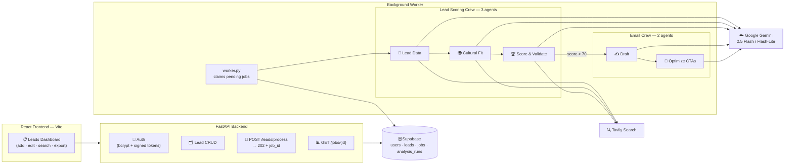

# Sales Pipeline — Lead Scoring & Email Generation

A full-stack, multi-agent sales pipeline application: a **React** dashboard backed by a **FastAPI** server that orchestrates **CrewAI** agent crews (powered by **Google Gemini**) to score sales leads and draft personalized outreach emails, with all data stored in **Supabase**.

---

## Features

- **Landing page** — Stripe-inspired marketing page with an animated product demo: the five-agent pipeline lights up in sequence, the score counts up, and the email draft types itself.
- **React dashboard** — add, view, edit, delete, search, and export leads; per-lead analysis modal with token/cost/timing breakdowns; charts (industry, source, score distribution, leads over time).
- **Two CrewAI crews** — a 3-agent lead-scoring crew (data enrichment → cultural fit → scoring & validation) and a 2-agent email crew (draft → engagement optimization). Leads scoring above 70 get an email draft.
- **Web-search enrichment** — agents research leads live via **Tavily** search and website scraping.
- **Asynchronous job queue** — processing runs in a background worker; the API responds instantly and the UI polls job status, so long LLM runs never block requests.
- **Token-based auth** — signup/login with bcrypt password hashing and signed session tokens; every lead endpoint is ownership-checked.
- **YAML-driven agents** — all agent roles, task prompts, and workflow logic configurable in `backend/config/` without code changes.
- **Red-team test suite** — adversarial inputs (fake companies, prompt injection, contradictory data) with saved pass/fail reports.

---

## Architecture


```mermaid
graph LR
    subgraph FE [React Frontend — Vite]
        UI["📋 Leads Dashboard<br>(add · edit · search · export)"]
    end

    subgraph API [FastAPI Backend]
        Auth["🔐 Auth<br>(bcrypt + signed tokens)"]
        CRUD["🗂️ Lead CRUD"]
        Enq["📨 POST /leads/process<br>→ 202 + job_id"]
        Jobs["📊 GET /jobs/{id}"]
    end

    subgraph Worker [Background Worker]
        W["worker.py<br>claims pending jobs"]
        subgraph LeadCrew [Lead Scoring Crew — 3 agents]
            A1["🔎 Lead Data"] --> A2["🌍 Cultural Fit"] --> A3["🏆 Score & Validate"]
        end
        subgraph EmailCrew [Email Crew — 2 agents]
            E1["✍️ Draft"] --> E2["🎯 Optimize CTAs"]
        end
        W --> A1
        A3 -->|score > 70| E1
    end

    DB[("🗄️ Supabase<br>users · leads · jobs · analysis_runs")]
    LLM["☁️ Google Gemini<br>2.5 Flash / Flash-Lite"]
    Tavily["🔍 Tavily Search"]

    UI --> API
    API --> DB
    W --> DB
    A1 & A2 & A3 & E1 & E2 --> LLM
    A1 & A2 & A3 --> Tavily
```

## Project Structure

```
.
├── backend/
│   ├── backend.py            # FastAPI app: auth, lead CRUD, job enqueue/status
│   ├── worker.py             # Background job processor (runs the crews)
│   ├── pipeline.py           # CrewAI crews + Flow + process_leads entry point
│   ├── security.py           # bcrypt hashing + signed session tokens
│   ├── requirements.txt      # pinned Python dependencies
│   └── config/               # agent & task YAML definitions (both crews)
├── frontend/                 # React + Vite dashboard + landing page (Stripe-inspired design system)
├── adversarial_testing.py    # red-team test suite
├── test_crews.py             # crew smoke test + CrewAI eval runs
└── tests/test_security.py    # no-network unit tests (run in CI)
```

---

## Setup

### 1. Supabase

Create a project at [supabase.com](https://supabase.com) with tables `users` (id, username, password), `leads`, and `analysis_runs`, plus a `jobs` queue table (id, user_id, status, leads jsonb, gemini_api_key, tavily_api_key, results jsonb, error, created_at), a unique constraint on `users.username`, and indexes on `jobs(status, created_at)`, `leads(user_id)`, and `analysis_runs(lead_id)`.

> **Note on RLS:** the backend uses a service key, which bypasses Row Level Security; authorization is enforced at the API layer (token + ownership checks). Enabling RLS as a second layer is recommended for defense in depth.

### 2. Backend

```bash
cd backend
python -m venv .venv
.venv\Scripts\activate        # Windows
source .venv/bin/activate     # Linux/Mac
pip install -r requirements.txt
```

Create `backend/.env`:

```
SUPABASE_URL=your_supabase_url
SUPABASE_KEY=your_supabase_service_key
SECRET_KEY=any_long_random_string   # signs session tokens; required in production
```

Run the API and the worker (two terminals, from the repo root):

```bash
uvicorn backend.backend:app --host 0.0.0.0 --port 8000
python backend/worker.py
```

> **Single-process deploys (e.g. Render free tier):** instead of a separate
> worker service, set `RUN_WORKER_IN_PROCESS=1` on the web service — the job
> worker then runs as a background thread inside the API process. Switch back
> to a dedicated worker (and unset the flag) when you need more throughput.

### 3. Frontend

```bash
cd frontend
npm install
npm run dev        # http://localhost:5173 (expects the API on localhost:8000)
```

Set `VITE_BACKEND_URL` to point at a deployed backend in production builds.

### 4. API keys (per user, entered in the app)

Each user supplies their own keys in the sidebar after logging in — they are held in memory for the session and stored only for the duration of a processing job:

- **Gemini** — [aistudio.google.com/app/apikey](https://aistudio.google.com/app/apikey) (powers all agents)
- **Tavily** — [app.tavily.com](https://app.tavily.com) (web-search enrichment)

---

## How to Use

1. **Get started from the landing page** — sign up or log in (username ≥ 3 chars, password ≥ 8 chars).
2. **Enter your Gemini and Tavily API keys** in the sidebar.
3. **Add a lead** (name, company, email required) and click **Save & Process** — the lead is queued, the crews score it and (if it scores above 70) draft an email; the UI polls until the job completes.
4. **Review results** — expand a lead card for the scoring breakdown and email draft; open **📊 Analysis** for duration, token, and cost details (per-agent numbers are even-split estimates of the crew totals).
5. **Search / export** — filter the table and export the filtered set to CSV.

At most **10 leads** can be processed per request; job status is `pending → running → done | failed`.

---

## Scaling notes

- Lead processing is decoupled from HTTP via the `jobs` table; add more `worker.py` processes to increase throughput.
- Auth tokens are stateless (HMAC-signed), so API instances scale horizontally behind a load balancer — set the same `SECRET_KEY` on every instance.
- The login rate limiter is in-memory (per instance); move it to Redis when running multiple API instances.

---

## Testing & Evaluation

- **Unit tests (no network):** `python tests/test_security.py` — also run in CI (`.github/workflows/ci.yml`) along with syntax checks, frontend lint, and build.
- **Crew smoke test + eval:** `python test_crews.py` (needs `GEMINI_API_KEY`/`TAVILY_API_KEY`; makes real LLM calls).
- **Red teaming:** `python adversarial_testing.py` runs adversarial leads (fake company, prompt injection, contradictory data, incomplete lead, biased framing, duplicates) and saves a report to `adversarial_results/`. Latest run: **5/6 passed** — see `adversarial_results/run_2026-03-27_15-54-07.json`.

### Evaluation Results

The pipeline was evaluated with CrewAI's built-in evaluation framework across **two independent runs**, scoring each agent task 1–10 (LLM-as-judge; no human baseline yet).

#### 🔎 Lead Scoring Crew — Avg Score: **9.9 / 10** *(~109s execution)*


- **Lead Data Specialist**: 10.0 / 9.5 across runs (avg 9.8)
- **Cultural Fit Analyst**: 10.0 in both runs
- **Lead Scorer & Validator**: 10.0 in both runs

#### ✍️ Email Generation Crew — Avg Score: **9.8 / 10** *(~138s execution)*


- **Email Content Writer**: 10.0 / 9.5 across runs (avg 9.8)
- **Engagement Optimization Specialist**: 10.0 in both runs

| Crew | Average Score | Execution Time |
|---|---|---|
| Lead Scoring Crew (3 agents) | 9.9 / 10 | ~109 s |
| Email Generation Crew (2 agents) | 9.8 / 10 | ~138 s |

---

## Troubleshooting

- **"Missing authentication token" / session expired** — log in again; tokens last 24 h and the UI session 1 h (sliding).
- **Job stuck in `pending`** — the worker isn't running; start `python backend/worker.py`.
- **Supabase errors on startup** — the backend refuses to start without `SUPABASE_URL`/`SUPABASE_KEY` in `backend/.env`.
- **429 on login** — five failed attempts triggers a 15-minute lockout for that username.
