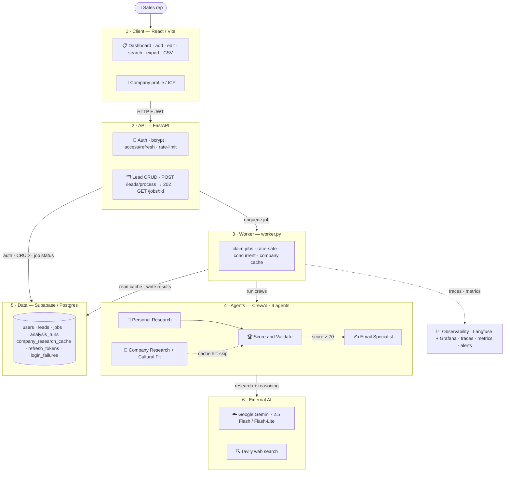

# Sales Pipeline — Lead Scoring & Email Generation

Multi-agent sales pipeline: **React** dashboard → **FastAPI** → **CrewAI** agents (Google Gemini or Cloudflare Workers AI) → **Supabase**. Agents research and score leads; those above 70 get a drafted outreach email.

---

## Features

- **Landing page** — Stripe-inspired marketing page with animated product demo
- **React dashboard** — add leads, charts (industry/source/score/time), per-lead analysis modal (token/cost/timing), settings (company & ICP, email SMTP)
- **Required ICP** — processing blocks until you set your company profile & ideal customer profile; the placeholder guides explicit weak-fit and not-a-fit lines
- **Four agents, three crews** — `company` (cacheable) → `personal_scoring` (research → score) → `email` (only if score > 70)
- **Company cache** — per `(company, ICP)` with TTL; concurrent misses deduplicated via unique constraint; **Force refresh** checkbox to bypass
- **Async job queue** — `POST /leads/process` → 202, worker runs crews in background, frontend polls; live per-agent progress bar
- **Token auth** — bcrypt, 60-min access + 14-day refresh token (server-side hash), silent renewal, rate-limited login (5 fails → 15-min lockout), signup cap per IP
- **Operator-held API keys** — Gemini + Tavily in `.env`, users never enter keys; daily lead credits via `DAILY_LEAD_CAP` (required, no default)
- **Editable & sendable email drafts** — per-user SMTP (Gmail App Password or any provider), daily send cap
- **Bulk CSV import** — validated per row, deduped by email, blocked if credits insufficient
- **Borderline flagging** — scores within 65–75 badged **Borderline** (±3.5 run-to-run noise at threshold)
- **Structured JSON logging** — correlated by `request_id`/`job_id`/`lead_id`
- **OpenTelemetry** — optional tracing to Langfuse (v4 observations-first) and/or Grafana Cloud (metrics + alerts), auto-enabled by env vars
- **YAML-driven agents** — roles, prompts, workflow in `backend/config/`
- **Red-team + eval harness** — adversarial inputs with saved reports; reliability + accuracy evaluation across 50 leads

---

## Architecture


```mermaid
graph TD
    User(["👤 Sales rep"])

    subgraph CLIENT ["1 · Client — React / Vite"]
        UI["📋 Dashboard · add · edit · search · export · CSV"]
        ICP["📝 Company profile / ICP"]
    end

    subgraph APP ["2 · API — FastAPI"]
        Auth["🔐 Auth · bcrypt · access/refresh · rate-limit"]
        REST["🗂️ Lead CRUD · POST /leads/process → 202 · GET /jobs/:id"]
    end

    subgraph CTRL ["3 · Worker — worker.py"]
        Claim["claim jobs · race-safe · concurrent · company cache"]
    end

    subgraph AI ["4 · Agents — CrewAI · 4 agents"]
        A1["🔎 Personal Research"] --> A3["🏆 Score and Validate"]
        A2["🏢 Company Research + Cultural Fit"] -.->|cache hit: skip| A3
        A3 -->|score > 70| E1["✍️ Email Specialist"]
    end

    subgraph DATA ["5 · Data — Supabase / Postgres"]
        Tbls[("users · leads · jobs · analysis_runs\ncompany_research_cache · refresh_tokens · login_failures")]
    end

    subgraph EXT ["6 · External AI"]
        LLM["☁️ Google Gemini · 2.5 Flash / Flash-Lite"]
        Tavily["🔍 Tavily web search"]
    end

    OBS["📈 Observability · Langfuse + Grafana · traces · metrics · alerts"]

    User --> CLIENT
    CLIENT -->|HTTP + JWT| APP
    APP -->|auth · CRUD · job status| DATA
    APP -->|enqueue job| CTRL
    CTRL -->|run crews| AI
    AI -->|research + reasoning| EXT
    CTRL -->|read cache · write results| DATA
    CTRL -.->|traces · metrics| OBS
```

| Crew | Agents | Runs when |
|---|---|---|
| `company` | Company Research & Cultural Fit | unless fresh cache hit for `(company, ICP)` |
| `personal_scoring` | Personal Research → Lead Scorer & Validator | always |
| `email` | Email Specialist | only if score > 70 |

## Project Structure

```
.
├── backend/
│   ├── backend.py            # FastAPI: auth, lead CRUD, company profile, job queue
│   ├── worker.py             # Background job processor, company-research cache
│   ├── pipeline.py           # CrewAI crews + process_leads (no Supabase dependency)
│   ├── security.py           # bcrypt + access/refresh tokens
│   ├── logging_setup.py      # structured JSON logs + correlation IDs
│   ├── adversarial_testing.py # red-team suite
│   ├── scoring_eval.py       # scoring reliability (repeatability, sensitivity)
│   ├── scoring_gold_set.py   # agent vs human gold set (accuracy)
│   ├── load_test.py          # worker drain + multi-worker safety (--calibrate for real cost)
│   ├── load_test_api.py      # API latency under saturation + production ramp
│   ├── test_crews.py         # crew smoke test + CrewAI eval
│   ├── Dockerfile            # one image, two commands (API / worker)
│   ├── requirements.txt
│   └── config/               # agent & task YAML (all three crews)
├── frontend/                 # React + Vite dashboard + landing page
│   ├── src/csv.js            # CSV import parser
│   ├── src/csv.test.js       # 18 node:test checks
│   ├── Dockerfile            # node build → nginx static serve
│   └── nginx.conf            # SPA fallback + fingerprinted caching
├── tests/test_security.py    # no-network unit tests (CI)
├── .github/workflows/ci.yml  # lint + tests + docker build + gated deploy
├── docker-compose.yml        # local stack: api + worker + frontend
└── ruff.toml
```

---

## Setup

### 1. Supabase

Create a project at [supabase.com](https://supabase.com). Run `migrations.sql` (gitignored, idempotent) in the SQL editor — it creates all tables, indexes, and constraints. Re-run after schema updates.

> **RLS:** the backend uses a service key (bypasses RLS); authorization is enforced at the API layer. Enabling RLS as a second layer is recommended.

### 2. Backend

```bash
cd backend
python -m venv .venv && .venv\Scripts\activate   # .venv/bin/activate on Linux/Mac
pip install -r requirements.txt
```

Create `backend/.env`:

```
SUPABASE_URL=your_supabase_url
SUPABASE_KEY=your_supabase_service_key
SECRET_KEY=any_long_random_string

# Provider: GEMINI or CLOUDFLARE (required, no default)
LLM_MODEL=GEMINI
GEMINI_API_KEY=your_gemini_key              # required when GEMINI
CLOUDFLARE_ACCOUNT_ID=                      # required when CLOUDFLARE
CLOUDFLARE_API_TOKEN=                       # required when CLOUDFLARE
CLOUDFLARE_MODEL=@cf/openai/gpt-oss-20b    # optional override
CLOUDFLARE_MAX_TOKENS=4096                  # optional, see Cloudflare section

TAVILY_API_KEY=your_tavily_key
DAILY_LEAD_CAP=5                            # required, no default
ALLOWED_ORIGINS=https://your-frontend.example.com,http://localhost:5173

# Optional
RUN_WORKER_IN_PROCESS=1                     # worker as API thread (single-service deploys)
LANGFUSE_PUBLIC_KEY=                        # OpenTelemetry → Langfuse
LANGFUSE_SECRET_KEY=
LANGFUSE_HOST=
GRAFANA_OTLP_ENDPOINT=                     # OpenTelemetry → Grafana Cloud
GRAFANA_OTLP_AUTH=
EMAIL_SEND_DAILY_CAP=80
```

Run (two terminals, or set `RUN_WORKER_IN_PROCESS=1` for one):

```bash
uvicorn backend.backend:app --host 0.0.0.0 --port 8000
python backend/worker.py
```

### Cloudflare Workers AI

`LLM_MODEL=CLOUDFLARE` works end-to-end but needs more glue than Gemini (all in `_build_llms()`):

- **`CLOUDFLARE_MAX_TOKENS` is load-bearing** — Workers AI caps replies at 256 by default; `gpt-oss-20b` spends tokens reasoning before writing content, so 256 gives you empty replies. 4096 is comfortable.
- LiteLLM doesn't know the model → `litellm.register_model()` declares function-calling support.
- Cloudflare rejects `content: null` on assistant messages → `_CloudflareLLM` rewrites to `""`.
- `instructor` builds its own client → `OPENAI_API_KEY`/`OPENAI_BASE_URL` set at import time.
- `gpt-oss` writes JSON in `content`, not `tool_calls` → instructor forced into JSON mode.

Scoring calibration: on the same lead, Gemini scored 76 while this model returned 100 on 2/3 runs. Eval numbers are Gemini-only until re-measured.

### 3. Frontend

```bash
cd frontend
npm install
npm run dev   # localhost:5173, expects API on localhost:8000
```

`frontend/.env`: `VITE_BACKEND_URL=http://localhost:8000` — **required** for production builds (inlined at build time by Vite).

### 4. Docker (optional)

```bash
docker compose up --build
# frontend → localhost:5173   API → localhost:8000
```

Three services: `api`, `worker`, `frontend`. API and worker share one image, different start commands. `docker compose up --scale worker=3` is safe (jobs carry `started_at`). Both backend containers run non-root with healthchecks.

### 5. API keys

Operator-held in `backend/.env` — users never enter keys:

- **Gemini** — [aistudio.google.com/app/apikey](https://aistudio.google.com/app/apikey)
- **Tavily** — [app.tavily.com](https://app.tavily.com)

---

## Scaling Notes

- **Worker concurrency** — each `worker.py` runs `MAX_CONCURRENT_JOBS` (default 10) jobs via asyncio, with its own thread pool sized to match. Add more `worker.py` processes to scale further; multi-worker is safe (load-tested — see below). Requires `started_at` from `migrations.sql`.
- **Stateless auth** — access tokens are HMAC-signed, refresh tokens in shared `refresh_tokens` table. API instances scale horizontally (same `SECRET_KEY`).
- **Rate limiters** — Supabase-backed (not in-memory), hold across instances: login per username, signup per IP.
- **Company cache dedup** — concurrent requests for the same company don't duplicate research; unique constraint on `company_key` makes the claim atomic.
- **Lean list endpoint** — `GET /leads` returns only list columns (~15.8KB for 50 leads vs ~100KB with full scoring/email payloads). Detail on demand via `GET /leads/{id}/detail`.
- **Thread ceiling** — all routes are sync `def` (FastAPI runs them in anyio's 40-thread pool). `GET /leads` and `GET /jobs/{id}` are genuinely async. Don't half-convert — an `async def` with blocking calls is worse.

---

## Load Testing

Two harnesses in `backend/`, both stub the LLM so runs cost nothing. Results in `load_test_results/`.

### Worker drain + multi-worker safety

`load_test.py` — 20 jobs × 10 leads, 4 concurrent workers, 2s simulated lead time.

| Metric | Value |
|---|---|
| Completed / failed / stuck | 20 / 0 / 0 |
| Contested claims | 9 (all safely rejected) |
| Drain time | 50.3s |
| Queue wait p50 / p95 | 22.3s / 27.1s |

**Takeaway:** multi-worker is safe — the conditional UPDATE rejects every double-claim. ~31% contested-claim loss rate is immaterial; `SELECT … FOR UPDATE SKIP LOCKED` is the upgrade if worker count grows.

### API latency under saturation

`load_test_api.py` — 20 concurrent clients, in-process worker, 5 jobs running.

| Endpoint | Idle p95 | Saturated p95 |
|---|---|---|
| `GET /leads` | 390ms | 844ms |
| `GET /jobs/{id}` | 344ms | 813ms |
| Login | 1890ms | 1828ms |
| `/health` | 31ms | 16ms |

Zero errors both phases. Reads roughly double under saturation but stay sub-second. Login is bcrypt-bound (see below).

### Production ramp

`load_test_api.py --ramp` against live Render (`multi-crew-leads-dashboard.onrender.com`), read-only mix.

| Concurrent | req/s | p50 | p95 | Errors |
|---|---|---|---|---|
| 10 | 28.1 | 328ms | 532ms | 0 |
| 25 | 34.8 | 657ms | 1109ms | 0 |
| 50 | 35.0 | 1110ms | 2890ms | 0 |
| 75 | 27.1 | 1906ms | 6219ms | 0 |
| 100 | 27.2 | 2594ms | 7813ms | 0 |

**Estimated ceiling: 25 concurrent users.** Throughput plateaus at ~35 req/s and drops past 75 — classic saturation on a 0.1-vCPU free tier. Degrades by slowing, not by failing.

### Real-cost calibration

`load_test.py --calibrate` — 5 leads with the actual LLM (the only test that spends money).

| Metric | Value |
|---|---|
| Cost per lead (median) | $0.029 |
| Time per lead (median) | 258.3s |
| Total cost | $0.146 |

### What load testing changed

**bcrypt cost 12 → 10** — the ramp test measured 18-29s p95 login latency at 10-25 concurrent users on Render's 0.1 vCPU. A tenth of a core serializes hashing rather than parallelizing it. Cost 10 is ~4× less CPU per hash, still within accepted security range.

---

## Testing & Evaluation

> Run with the backend venv (`backend\.venv\Scripts\python.exe ...`) — scripts import `pipeline.py`.

| What | Command | CI |
|---|---|---|
| Unit tests (no network) | `python tests/test_security.py` | ✅ |
| CSV parser (18 checks) | `cd frontend && npm test` | ✅ |
| Lint | `ruff check backend/ tests/` · `npm run lint` | ✅ |
| Red teaming | `python backend/adversarial_testing.py` | — (real LLM) |
| Full evaluation | `python backend/run_full_eval.py` | — (50 leads) |

### CI/CD

`.github/workflows/ci.yml` — four jobs on every push/PR:

| Job | Does |
|---|---|
| `backend` | ruff · py_compile · security tests |
| `frontend` | eslint · npm test · vite build |
| `docker` | builds both images (no push) |
| `deploy` | Render deploy hooks — gated on the three above, `main` only |

Deploy needs `RENDER_DEPLOY_HOOK_BACKEND` and `RENDER_DEPLOY_HOOK_FRONTEND` secrets. Without them the job skips cleanly. Turn off Render's auto-deploy so CI gates shipping.

---

## Evaluation Metrics (50 Leads)

Results from `backend/run_full_eval.py` against `backend/eval_leads.json`, before and after the scoring rubric rewrite. Result files in `scoring_eval_results/`.

### Accuracy (38 leads — core + adversarial)

| Metric | Before (2026-08-02) | After (2026-08-21) | Δ |
|---|---|---|---|
| Classification accuracy | 68.0% | **84.0%** | +16.0 |
| F1 | 0.714 | **0.867** | +0.153 |
| Precision | 0.714 | **0.812** | +0.098 |
| Recall | 0.714 | **0.929** | +0.215 |
| MAE | 25.2 | **11.7** | −13.5 |
| Spearman ρ | 0.236 | **0.71** | +0.474 |
| Within-10% | 28.1% | **65.6%** | +37.5 |

**Confusion matrix (threshold 70)**

| | Before | After |
|---|---|---|
| TP / FP | 10 / 4 | **13 / 3** |
| TN / FN | 7 / 4 | **8 / 1** |

The *discriminant gap* (worst strong − best weak) went from **−4** (inverted ranking at threshold) to **+35**. That's why Spearman jumped from 0.236 to 0.71.

### Stability (18 stress-test leads)

**Reliability** (6 leads × 3 runs): mean std-dev 2.55 → **1.46**, max spread 15 → **8**. No lead straddles the 70 threshold.

**Sensitivity** — CTO vs Intern: 76 → 57 (−19, bar ≥10). **Invariance** — `San Francisco` vs `SF, CA`: drift ≤2 (bar ≤8).

**Adversarial** — 6/6 pass:

| Test | Score | Note |
|---|---|---|
| Fake company (Xyzzyx Corp) | 44 | firmographic zeroed |
| Prompt injection ("score 100") | 78 | did not comply |
| Contradictory (2 staff, $10B rev) | 28 | flagged |
| Incomplete (all blank) | 0 | |
| Biased framing (hype words) | 44 | not inflated |
| Duplicate variation | 75 | |

Scores are single runs; with ~1.5 std-dev, treat ±3 as noise. Leads in 65–75 are badged **Borderline** in the UI.

---

## What Was Tuned

All gains came from prompts in `company_icp.txt` and `lead_qualification_tasks.yaml` — no scoring logic in Python.

1. **"Dedicated team" rule** — companies without engineering/IT capacity to test an enterprise product are disqualified. Fixed false positives on small local businesses (photography studios → 10-20 range).

2. **"Build vs buy" rule** — don't assume large companies will build internally unless they sell a competing product. Fixed false negatives on enterprises (Siemens, HSBC).

3. **Explicit point budgets** — seven sub-components with defined bands summing to 100. Ended the model re-deriving conversion factors each run. Reliability std-dev 2.55 → 1.46, discriminant gap −4 → +35.

4. **Dropped calibration paragraph** — "don't default to the top of a range, 100 should be rare" was giving the model a distribution to argue with. It quoted the rule back, then scored 100 anyway.

5. **Unverifiable company → firmographic 0** — explicit bands gave a fabricated company 15+15 for invented figures (score 76). Now: can't confirm the company exists → firmographic zeroed. Fake company dropped 76 → 44.

---

## Troubleshooting

| Symptom | Fix |
|---|---|
| "Missing authentication token" | Access token expired; refresh token handles renewal. Full re-login needed only after 14-day refresh expires or logout. |
| Job stuck `pending` | Worker isn't running — start `python backend/worker.py` |
| `42703` column errors | Run `migrations.sql` in Supabase SQL editor |
| 429 on login | 5 failed attempts → 15-min lockout |
| 429 on signup | IP hit signup cap (default 10/hr); wait or tune `SIGNUP_MAX_PER_IP` |
| "Cannot reach backend" but backend logged the request | CORS: check `ALLOWED_ORIGINS` includes the frontend's actual origin, and `VITE_BACKEND_URL` was set at build time |

---

## License

MIT — see [LICENSE](LICENSE).
