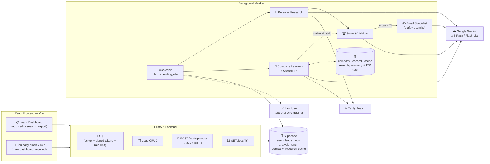

# Sales Pipeline — Lead Scoring & Email Generation

A full-stack, multi-agent sales pipeline application: a **React** dashboard backed by a **FastAPI** server that orchestrates **CrewAI** agent crews (powered by **Google Gemini**) to score sales leads and draft personalized outreach emails, with all data stored in **Supabase**.

---

## Features

- **Landing page** — Stripe-inspired marketing page with an animated product demo: the agent pipeline lights up in sequence, the score counts up, and the email draft types itself.
- **React dashboard** — add, view, edit, delete, search, and export leads; per-lead analysis modal with token/cost/timing breakdowns; charts (industry, source, score distribution, leads over time).
- **Required ICP** — your company profile & ideal customer profile live in the main dashboard (not a sidebar afterthought) and are required, not optional: processing a lead with none set pops a blocking dialog until you fill it in. No generic fallback exists.
- **Four-agent, three-crew pipeline** — a `company` crew (Company Research & Cultural Fit, cacheable), a `personal_scoring` crew (Personal Research → Lead Scoring & Validation), and an `email` crew (Email Specialist, draft + optimize) for leads scoring above 70.
- **Company research caching** — company facts + cultural fit are cached per (company, ICP) pair for repeat leads from the same company, with a short TTL (company status can change) and a **Force refresh** checkbox on the lead form to bypass it.
- **Web-search enrichment** — agents research leads live via **Tavily** search and website scraping.
- **Asynchronous job queue** — processing runs in a background worker; the API responds instantly and the UI polls job status, so long LLM runs never block requests.
- **Token-based auth** — signup/login with bcrypt password hashing and signed session tokens; every lead endpoint is ownership-checked; login is rate-limited (5 failed attempts → 15-minute lockout).
- **Structured JSON logging** — every log line is correlated by `request_id`/`job_id`/`lead_id`, so one request's or job's full story is a single grep away.
- **Langfuse tracing** — optional OpenTelemetry tracing of every crew/agent/LLM call via Langfuse + OpenLit, enabled automatically when Langfuse env vars are set.
- **Editable email drafts** — click **Edit** on a lead's drafted email to revise and save it inline.
- **YAML-driven agents** — all agent roles, task prompts, and workflow logic configurable in `backend/config/` without code changes.
- **Red-team test suite** — adversarial inputs (fake companies, prompt injection, contradictory data) with saved pass/fail reports.

---

## Architecture


```mermaid
graph LR
    subgraph FE [React Frontend — Vite]
        UI["📋 Leads Dashboard<br>(add · edit · search · export)"]
        ICP["📝 Company profile / ICP<br>(main dashboard, required)"]
    end

    subgraph API [FastAPI Backend]
        Auth["🔐 Auth<br>(bcrypt + signed tokens + rate limit)"]
        CRUD["🗂️ Lead CRUD"]
        Enq["📨 POST /leads/process<br>→ 202 + job_id"]
        Jobs["📊 GET /jobs/{id}"]
    end

    subgraph Worker [Background Worker]
        W["worker.py<br>claims pending jobs"]
        A1["🔎 Personal Research"] --> A3
        A2["🏢 Company Research<br>+ Cultural Fit"] -.->|cache hit: skip| A3["🏆 Score & Validate"]
        Cache[("🗄️ company_research_cache<br>keyed by company + ICP hash")]
        A2 <-.-> Cache
        A3 -->|score > 70| E1["✍️ Email Specialist<br>(draft + optimize)"]
        W --> A1 & A2
    end

    DB[("🗄️ Supabase<br>users · leads · jobs · analysis_runs · company_research_cache")]
    LLM["☁️ Google Gemini<br>2.5 Flash / Flash-Lite"]
    Tavily["🔍 Tavily Search"]
    Trace["📈 Langfuse<br>(optional OTel tracing)"]

    UI --> API
    ICP --> API
    API --> DB
    W --> DB
    A1 & A2 & A3 & E1 --> LLM
    A1 & A2 --> Tavily
    W -.-> Trace
```

Three separate `Crew` objects (not one monolith), because `company` needs to be independently skippable on a cache hit:

| Crew | Agents | Runs when |
|---|---|---|
| `company` | Company Research & Cultural Fit Analyst (A2) | always, unless a fresh cache entry exists for `(company, ICP)` |
| `personal_scoring` | Personal Research Specialist (A1) → Lead Scorer & Validator (A3) | always |
| `email` | Email Specialist (E1) | only if the score from `personal_scoring` is > 70 |

## Project Structure

```
.
├── backend/
│   ├── backend.py            # FastAPI app: auth, lead CRUD, company profile, job enqueue/status
│   ├── worker.py             # Background job processor (runs the crews, company-research cache)
│   ├── pipeline.py           # CrewAI crews + process_leads entry point (no Supabase dependency)
│   ├── security.py           # bcrypt hashing + signed session tokens
│   ├── logging_setup.py      # structured JSON logs + request/job/lead correlation IDs
│   ├── adversarial_testing.py # red-team test suite (needs backend/.venv — see below)
│   ├── test_crews.py         # crew smoke test + CrewAI eval runs (needs backend/.venv — see below)
│   ├── requirements.txt      # pinned Python dependencies
│   └── config/               # agent & task YAML definitions (all three crews)
├── frontend/                 # React + Vite dashboard + landing page (Stripe-inspired design system)
└── tests/test_security.py    # no-network unit tests (run in CI)
```

---

## Setup

### 1. Supabase

Create a project at [supabase.com](https://supabase.com) with tables `users` (id, username, password, **company_context** text), `leads`, and `analysis_runs`, plus:
- a `jobs` queue table (id, user_id, status, leads jsonb, gemini_api_key, tavily_api_key, results jsonb, error, created_at, **our_company_context** text, **force_refresh** boolean),
- a `company_research_cache` table (id, company_key **unique**, company_name, company_info jsonb, cultural_fit_score, cultural_fit_notes, cached_at) — the company-research cache, keyed by normalized company name + a hash of the ICP text; the unique constraint on `company_key` is also what makes the claim-before-research lock (see [Scaling notes](#scaling-notes)) atomic,
- a `login_failures` table (id, username, failed_at) — Supabase-backed login rate limiting,
- a unique constraint on `users.username`,
- indexes on `jobs(status, created_at)`, `leads(user_id)`, `analysis_runs(lead_id)`, `company_research_cache(company_key)`, and `login_failures(username, failed_at)`.

The exact DDL lives in a local `migrations.sql` (gitignored — it's operational, not source) that's kept up to date as the schema evolves; run it in the Supabase SQL editor. It's idempotent, so re-running it after a schema update only applies what changed.

> **Note on RLS:** the backend uses a service key, which bypasses Row Level Security; authorization is enforced at the API layer (token + ownership checks). Enabling RLS as a second layer is recommended for defense in depth.

### 2. Backend

```bash
cd backend
python -m venv .venv
.venv\Scripts\activate        # Windows
source .venv/bin/activate     # Linux/Mac
pip install -r requirements.txt
```

Create `backend/.env`:

```
SUPABASE_URL=your_supabase_url
SUPABASE_KEY=your_supabase_service_key
SECRET_KEY=any_long_random_string   # signs session tokens; required in production

# Optional — enables Langfuse/OpenTelemetry tracing of every crew/agent/LLM call
LANGFUSE_PUBLIC_KEY=
LANGFUSE_SECRET_KEY=
LANGFUSE_HOST=
```

Run the API and the worker (two terminals, from the repo root):

```bash
uvicorn backend.backend:app --host 0.0.0.0 --port 8000
python backend/worker.py
```

> **Single-process deploys (e.g. Render free tier):** instead of a separate
> worker service, set `RUN_WORKER_IN_PROCESS=1` on the web service — the job
> worker then runs as a background thread inside the API process. Switch back
> to a dedicated worker (and unset the flag) when you need more throughput.

### 3. Frontend

```bash
cd frontend
npm install
npm run dev        # http://localhost:5173 (expects the API on localhost:8000)
```

Set `VITE_BACKEND_URL` to point at a deployed backend in production builds.

### 4. API keys (per user, entered in the app)

Each user supplies their own keys in the sidebar after logging in — they are held in memory for the session and stored only for the duration of a processing job:

- **Gemini** — [aistudio.google.com/app/apikey](https://aistudio.google.com/app/apikey) (powers all agents)
- **Tavily** — [app.tavily.com](https://app.tavily.com) (web-search enrichment)

---

## How to Use

1. **Get started from the landing page** — sign up or log in (username ≥ 3 chars, password ≥ 8 chars).
2. **Enter your Gemini and Tavily API keys** in the sidebar.
3. **Describe your company & ICP** in the main dashboard's Company Profile card and save it — this is what cultural-fit assessment and email drafting are measured against, and it's **required**: try to process a lead with it empty and a dialog blocks you until you fill it in (no generic fallback exists).
4. **Add a lead** (name, company, email required) and click **Save & Process** — the lead is queued, the crews score it and (if it scores above 70) draft an email; the UI polls until the job completes. Check **Force refresh** first to bypass the company-research cache for that batch.
5. **Review results** — expand a lead card for the scoring breakdown and email draft (click **Edit** on the draft to revise and save it); open **📊 Analysis** for duration, token, and cost details (per-agent numbers are even-split estimates of the crew totals; a row marked **Cached** means company research was served from cache, **Skipped** means the email crew never ran because the score was ≤ 70 — both always listed at 0, so the breakdown always shows all 4 agents).
6. **Search / export** — filter the table and export the filtered set to CSV.

At most **10 leads** can be processed per request; job status is `pending → running → done | failed`.

---

## Scaling notes

- Lead processing is decoupled from HTTP via the `jobs` table. Each `worker.py` process runs up to `MAX_CONCURRENT_JOBS` (default 10) jobs concurrently via `asyncio` — unrelated users' jobs run in parallel, not queued behind each other one at a time. Add more `worker.py` processes to raise the ceiling further.
- Auth tokens are stateless (HMAC-signed), so API instances scale horizontally behind a load balancer — set the same `SECRET_KEY` on every instance.
- The login rate limiter is Supabase-backed (`login_failures` table), not in-memory, so the lockout holds correctly across multiple API instances.
- Company research (facts + cultural fit) is cached per `(company, ICP)` pair — `COMPANY_CACHE_TTL_DAYS` (default 7) bounds how long a company shutting down / getting acquired could go undetected; `ProcessLeadsRequest.force_refresh` bypasses the cache for a batch, exposed in the UI as a **Force refresh** checkbox on the lead form.
- Concurrent requests for the same brand-new company don't duplicate the research: the first cache miss atomically claims the row (`company_key` is unique), so a second concurrent miss waits on the winner instead of re-running Tavily + Gemini itself.

---

## Testing & Evaluation

> **Run these with the backend virtualenv's Python, not your system Python** — they import `pipeline.py`, which needs crewai and friends installed only in `backend/.venv`. Either activate it first (`backend\.venv\Scripts\activate` on Windows) or invoke it directly (`backend\.venv\Scripts\python.exe backend\test_crews.py`). Both scripts detect the wrong interpreter and tell you the exact command to use instead of failing with a bare traceback.

- **Unit tests (no network):** `python tests/test_security.py` — also run in CI (`.github/workflows/ci.yml`) along with syntax checks, frontend lint, and build.
- **Crew smoke test + eval:** `python backend/test_crews.py` (needs `GEMINI_API_KEY`/`TAVILY_API_KEY`; makes real LLM calls).
- **Red teaming:** `python backend/adversarial_testing.py` runs adversarial leads (fake company, prompt injection, contradictory data, incomplete lead, biased framing, duplicates) and saves a report to `adversarial_results/` at the repo root. Latest run: **6/6 passed** — see `adversarial_results/run_2026-07-18_15-32-27.json`.

### Evaluation Results

The pipeline was evaluated with CrewAI's built-in evaluation framework (`backend/test_crews.py`, LLM-as-judge, no human baseline yet) across **two independent runs per crew** — one table per crew, since `crew.test()` evaluates a single `Crew` object at a time and, per the [Architecture](#architecture) above, there are three: `company`, `personal_scoring`, `email`.

#### 🏢 Company Crew — Avg Score: **10.0 / 10** *(~21s execution)*


- **Company Research & Cultural Fit Analyst**: 10.0 in both runs

#### 🔎 Personal Research + Scoring Crew — Avg Score: **10.0 / 10** *(~20s execution)*


- **Personal Research Specialist**: 10.0 in both runs
- **Lead Scorer and Validator**: 10.0 in both runs

#### ✍️ Email Crew — Avg Score: **9.5 / 10** *(~11s execution)*


- **Email Specialist**: 10.0 / 9.0 across runs (avg 9.5)

| Crew | Agents | Average Score | Execution Time |
|---|---|---|---|
| Company | 1 | 10.0 / 10 | ~21 s |
| Personal Research + Scoring | 2 | 10.0 / 10 | ~20 s |
| Email | 1 | 9.5 / 10 | ~11 s |

---

## Troubleshooting

- **"Missing authentication token" / session expired** — log in again; tokens last 24 h and the UI session 1 h (sliding).
- **Job stuck in `pending`** — the worker isn't running; start `python backend/worker.py`.
- **Supabase errors on startup** — the backend refuses to start without `SUPABASE_URL`/`SUPABASE_KEY` in `backend/.env`.
- **429 on login** — five failed attempts triggers a 15-minute lockout for that username.
- **`column users.company_context does not exist` (or similar `42703` errors)** — the schema migration hasn't been applied yet; run the latest `migrations.sql` in the Supabase SQL editor.
