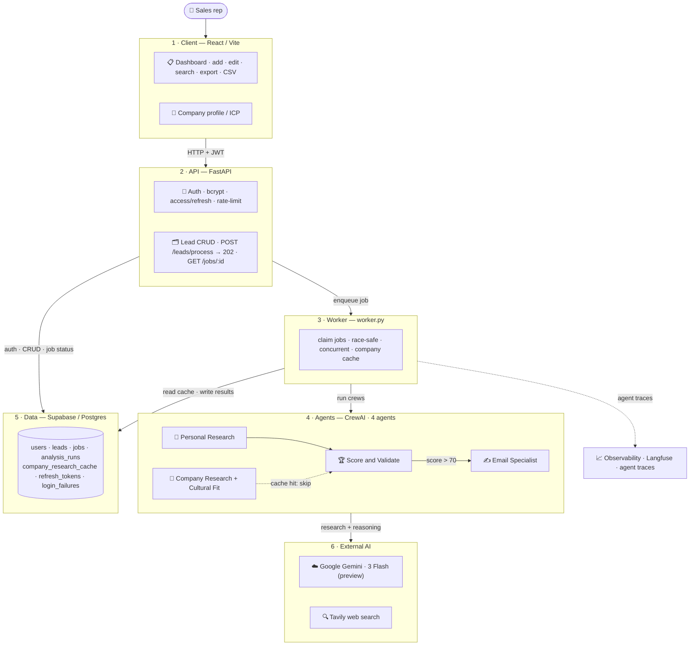

# Sales Pipeline — Lead Scoring & Email Generation

Multi-agent sales pipeline: **React** dashboard → **FastAPI** → **CrewAI** agents (Google Gemini or Cloudflare Workers AI) → **Supabase**. Agents research and score leads; those above 70 get a drafted outreach email automatically, and borderline leads (65–70) can draft one on demand.

---

## Features

- **Landing page** — Stripe-inspired marketing page with animated product demo
- **React dashboard** — add leads; summary boxes (leads processed, total cost, avg cost per lead, tokens used, emails drafted); charts for leads, avg cost and avg tokens per lead by month (each with its own year picker), score bands (>70 / ≤70 / borderline), score distribution, industry, source and country; per-lead analysis modal (token/cost/timing); settings (company & ICP, email SMTP, optional API keys)
- **Required ICP** — processing blocks until you set your company profile & ideal customer profile; the placeholder guides explicit weak-fit and not-a-fit lines
- **Four agents, three crews** — `company` (cacheable) → `personal_scoring` (research → score) → `email` (automatically if score > 70; on demand for borderline leads below 70)
- **Company cache** — per `(company, ICP)` with TTL; concurrent misses deduplicated via unique constraint; **Force refresh** checkbox to bypass. Same lead run 10 times: **55s uncached → 31s average cached** (company research skipped; the lookup itself is ~0.3s)
- **Async job queue** — `POST /leads/process` → 202, worker runs crews in background, frontend polls; live per-agent progress bar
- **Token auth** — bcrypt, 60-min access + 14-day refresh token (server-side hash), silent renewal, session ends when the tab closes, rate-limited login (5 fails → 15-min lockout), signup cap per IP
- **Operator-held API keys, optional bring-your-own** — Gemini + Tavily in `.env` by default, so users don't need keys; daily lead credits via `DAILY_LEAD_CAP` (required, no default); failed jobs don't use credits. Users can save their own Gemini/Tavily keys in Settings (encrypted, shown only as the last 4 characters); each overrides ours, and with both saved the credit limit goes away
- **Editable & sendable email drafts** — per-user SMTP (Gmail App Password or any provider), daily send cap. The app password is stored encrypted, shown only as its last 4 characters, and the SMTP login is checked before settings are saved
- **Bulk CSV import** — validated per row, deduped by email, blocked if operator-key credits are insufficient
- **Borderline flagging** — scores within 65–75 badged **Borderline**; leads scoring 65–70 get a **Draft Email** button to run just the email crew on demand
- **Structured JSON logging** — correlated by `request_id`/`job_id`/`lead_id`
- **Audit trail** — lead create/import/edit/delete, job submits, email drafts and sends, settings changes, and successful signups/logins are written to the `audit_events` table with the acting user (taken from the login token, never the request), target, outcome, status and request ID. No request bodies or secrets are stored; reads and agent steps aren't recorded (Langfuse covers agents)
- **OpenTelemetry** — optional CrewAI and LLM tracing to Langfuse, auto-enabled by its keys
- **YAML-driven agents** — roles, prompts, workflow in `backend/config/`
- **Red-team + eval harness** — adversarial inputs with saved reports; reliability + accuracy evaluation across 60 leads

---

## Architecture


```mermaid
graph TD
    User(["👤 Sales rep"])

    subgraph CLIENT ["1 · Client — React / Vite"]
        UI["📋 Dashboard · add · edit · search · export · CSV"]
        ICP["📝 Company profile / ICP"]
    end

    subgraph APP ["2 · API — FastAPI"]
        Auth["🔐 Auth · bcrypt · access/refresh · rate-limit"]
        REST["🗂️ Lead CRUD · POST /leads/process → 202 · GET /jobs/:id"]
    end

    subgraph CTRL ["3 · Worker — worker.py"]
        Claim["claim jobs · race-safe · concurrent · company cache"]
    end

    subgraph AI ["4 · Agents — CrewAI · 4 agents"]
        A1["🔎 Personal Research"] --> A3["🏆 Score and Validate"]
        A2["🏢 Company Research + Cultural Fit"] -.->|cache hit: skip| A3
        A3 -->|score > 70| E1["✍️ Email Specialist"]
    end

    subgraph DATA ["5 · Data — Supabase / Postgres"]
        Tbls[("users · leads · jobs · analysis_runs\ncompany_research_cache · refresh_tokens · login_failures")]
    end

    subgraph EXT ["6 · External AI"]
        LLM["☁️ Google Gemini · 3 Flash (preview)"]
        Tavily["🔍 Tavily web search"]
    end

    OBS["📈 Observability · Langfuse · agent traces"]

    User --> CLIENT
    CLIENT -->|HTTP + JWT| APP
    APP -->|auth · CRUD · job status| DATA
    APP -->|enqueue job| CTRL
    CTRL -->|run crews| AI
    AI -->|research + reasoning| EXT
    CTRL -->|read cache · write results| DATA
    CTRL -.->|agent traces| OBS
```

| Crew | Agents | Runs when |
|---|---|---|
| `company` | Company Research & Cultural Fit | unless fresh cache hit for `(company, ICP)` |
| `personal_scoring` | Personal Research → Lead Scorer & Validator | always |
| `email` | Email Specialist | automatically if score > 70; on demand for borderline scores below 70 |

## Project Structure

```
.
├── backend/
│   ├── backend.py            # FastAPI: auth, lead CRUD, company profile, job queue
│   ├── worker.py             # Background job processor, company-research cache
│   ├── pipeline.py           # CrewAI crews + process_leads (no Supabase dependency)
│   ├── security.py           # bcrypt + access/refresh tokens
│   ├── logging_setup.py      # structured JSON logs + correlation IDs
│   ├── adversarial_testing.py # red-team suite
│   ├── run_full_eval.py      # 60-lead evaluation (accuracy + stability + adversarial)
│   ├── compute_metrics.py    # metrics helper for run_full_eval
│   ├── load_test.py          # worker drain + multi-worker safety (--calibrate for real cost)
│   ├── load_test_api.py      # API latency under saturation + production ramp
│   ├── Dockerfile            # one image, two commands (API / worker)
│   ├── requirements.txt
│   └── config/               # agent & task YAML (all three crews)
├── frontend/                 # React + Vite dashboard + landing page
│   ├── src/csv.js            # CSV import parser
│   ├── src/csv.test.js       # 18 node:test checks
│   ├── Dockerfile            # node build → nginx static serve
│   └── nginx.conf            # SPA fallback + fingerprinted caching
├── tests/test_security.py    # no-network unit tests (CI)
├── .github/workflows/ci.yml  # lint + tests + docker build + gated deploy
├── docker-compose.yml        # local stack: api + worker + frontend
└── ruff.toml
```

---

## Setup

### 1. Supabase

Create a project at [supabase.com](https://supabase.com). Run `migrations.sql` (gitignored, idempotent) in the SQL editor — it creates all tables, indexes, and constraints. Re-run after schema updates.

> **RLS:** the backend uses a service key (bypasses RLS); authorization is enforced at the API layer. Enabling RLS as a second layer is recommended.

### 2. Backend

```bash
cd backend
python -m venv .venv && .venv\Scripts\activate   # .venv/bin/activate on Linux/Mac
pip install -r requirements.txt
```

Create `backend/.env`:

```
SUPABASE_URL=your_supabase_url
SUPABASE_KEY=your_supabase_service_key
SECRET_KEY=any_long_random_string           # also encrypts saved user keys/app passwords — keep it stable and identical everywhere

# Provider: GEMINI or CLOUDFLARE (required, no default)
LLM_MODEL=GEMINI
GEMINI_API_KEY=your_gemini_key              # required when GEMINI
CLOUDFLARE_ACCOUNT_ID=                      # required when CLOUDFLARE
CLOUDFLARE_API_TOKEN=                       # required when CLOUDFLARE
CLOUDFLARE_MODEL=@cf/openai/gpt-oss-20b    # optional override
CLOUDFLARE_MAX_TOKENS=4096                  # optional, see Cloudflare section

TAVILY_API_KEY=your_tavily_key
DAILY_LEAD_CAP=5                            # required, no default
ALLOWED_ORIGINS=https://your-frontend.example.com,http://localhost:5173

# Optional
RUN_WORKER_IN_PROCESS=1                     # worker as API thread (single-service deploys)
LANGFUSE_PUBLIC_KEY=                        # OpenTelemetry → Langfuse
LANGFUSE_SECRET_KEY=
LANGFUSE_HOST=
EMAIL_SEND_DAILY_CAP=80
```

Run (two terminals, or set `RUN_WORKER_IN_PROCESS=1` for one):

```bash
uvicorn backend.backend:app --host 0.0.0.0 --port 8000
python backend/worker.py
```

### Cloudflare Workers AI

`LLM_MODEL=CLOUDFLARE` works end-to-end but needs more glue than Gemini (all in `_build_llms()`):

- **`CLOUDFLARE_MAX_TOKENS` is load-bearing** — Workers AI caps replies at 256 by default; `gpt-oss-20b` spends tokens reasoning before writing content, so 256 gives you empty replies. 4096 is comfortable.
- LiteLLM doesn't know the model → `litellm.register_model()` declares function-calling support.
- Cloudflare rejects `content: null` on assistant messages → `_CloudflareLLM` rewrites to `""`.
- `instructor` builds its own client → `OPENAI_API_KEY`/`OPENAI_BASE_URL` set at import time.
- `gpt-oss` writes JSON in `content`, not `tool_calls` → instructor forced into JSON mode.

### 3. Frontend

```bash
cd frontend
npm install
npm run dev   # localhost:5173, expects API on localhost:8000
```

`frontend/.env`: `VITE_BACKEND_URL=http://localhost:8000` — **required** for production builds (inlined at build time by Vite).

### 4. Docker (optional)

```bash
docker compose up --build
# frontend → localhost:5173   API → localhost:8000
```

Three services: `api`, `worker`, `frontend`. API and worker share one image, different start commands. `docker compose up --scale worker=3` is safe (jobs carry `started_at`). Both backend containers run non-root with healthchecks.

### 5. API keys

Operator-held in `backend/.env`, used by default so users don't need keys:

- **Gemini** — [aistudio.google.com/app/apikey](https://aistudio.google.com/app/apikey)
- **Tavily** — [app.tavily.com](https://app.tavily.com)

Users may add their own in **Settings → API keys (optional)**. Each overrides the operator's key; with both saved, that user has no daily credit limit. Keys are encrypted with `SECRET_KEY` — if it changes, saved keys and app passwords can't be read and must be re-entered.

---

## Scaling Notes

- **Worker concurrency** — each `worker.py` runs `MAX_CONCURRENT_JOBS` (default 10) jobs via asyncio, with its own thread pool sized to match. Add more `worker.py` processes to scale further; multi-worker is safe (load-tested — see below). Requires `started_at` from `migrations.sql`.
- **Stateless auth** — access tokens are HMAC-signed, refresh tokens in shared `refresh_tokens` table. API instances scale horizontally (same `SECRET_KEY`).
- **Rate limiters** — Supabase-backed (not in-memory), hold across instances: login per username, signup per IP.
- **Company cache dedup** — concurrent requests for the same company don't duplicate research; unique constraint on `company_key` makes the claim atomic.
- **Lean list endpoint** — `GET /leads` returns only list columns (~15.8KB for 50 leads vs ~100KB with full scoring/email payloads). Detail on demand via `GET /leads/{id}/detail`.
- **Thread ceiling** — all routes are sync `def` (FastAPI runs them in anyio's 40-thread pool). `GET /leads` and `GET /jobs/{id}` are genuinely async. Don't half-convert — an `async def` with blocking calls is worse.

---

## Load Testing

Two harnesses in `backend/`, both stub the LLM unless calibration is explicitly requested. Results in `load_test_results/`.

### Worker drain + multi-worker safety

`load_test.py` — 20 jobs × 10 leads, 4 concurrent workers, 2s simulated lead time.

| Metric | Value |
|---|---|
| Completed / failed / stuck | 20 / 0 / 0 |
| Claims won / lost / empty | 20 / 9 / 25 |
| Worker boot | ~16.5s per worker |
| Drain time | 50.3s |
| Queue wait p50 / p95 | 22.3s / 27.1s |

**Design:** each job stamps `started_at` when claimed, and `fail_stale_running_jobs` ages each job against its own budget — so a booting worker can't reap another worker's in-flight jobs. The 9 contested claims (conditional UPDATE rejections) are the other safety layer; ~31% loss rate is immaterial, `SELECT … FOR UPDATE SKIP LOCKED` is the upgrade if worker count grows.

### API latency under saturation

`load_test_api.py` — 20 concurrent clients, in-process worker, 5 jobs running.

| Endpoint | Idle p95 | Saturated p95 |
|---|---|---|
| `GET /leads` | 390ms | 844ms |
| `GET /jobs/{id}` | 344ms | 813ms |
| Login | 1890ms | 1828ms |
| `/health` | 31ms | 16ms |

Zero errors both phases. Reads roughly double under saturation but stay sub-second. Login is bcrypt-bound (see below).

### Production ramp

`load_test_api.py --ramp` against live Render (`multi-crew-leads-dashboard.onrender.com`), read-only mix.

| Concurrent | req/s | p50 | p95 | Errors |
|---|---|---|---|---|
| 10 | 28.1 | 328ms | 532ms | 0 |
| 25 | 34.8 | 657ms | 1109ms | 0 |
| 50 | 35.0 | 1110ms | 2890ms | 0 |
| 75 | 27.1 | 1906ms | 6219ms | 0 |
| 100 | 27.2 | 2594ms | 7813ms | 0 |

**Estimated ceiling: 25 concurrent users.** Throughput plateaus at ~35 req/s and drops past 75 — classic saturation on a 0.1-vCPU free tier. Degrades by slowing, not by failing.

### Real-cost calibration

`load_test.py --calibrate` — 5 leads with the actual LLM (the only test that spends money).

| Metric | Value |
|---|---|
| Cost per lead (median) | $0.029 |
| Time per lead (median) | 258.3s |
| Total cost | $0.146 |

### What load testing changed

**bcrypt cost 12 → 10** — the ramp test measured 18-29s p95 login latency at 10-25 concurrent users on Render's 0.1 vCPU. A tenth of a core serializes hashing rather than parallelizing it. Cost 10 is ~4× less CPU per hash, still within accepted security range.

---

## Testing & Evaluation

> Run with the backend venv (`backend\.venv\Scripts\python.exe ...`) — scripts import `pipeline.py`.

| What | Command | CI |
|---|---|---|
| Unit tests (no network) | `python tests/test_security.py` | ✅ |
| CSV parser (18 checks) | `cd frontend && npm test` | ✅ |
| Lint | `ruff check backend/ tests/` · `npm run lint` | ✅ |
| Red teaming | `python backend/adversarial_testing.py` | — (real LLM) |
| Full evaluation | `python backend/run_full_eval.py` | — (60 leads) |

### CI/CD

`.github/workflows/ci.yml` — four jobs on every push/PR:

| Job | Does |
|---|---|
| `backend` | ruff · py_compile · security tests |
| `frontend` | eslint · npm test · vite build |
| `docker` | builds both images (no push) |
| `deploy` | Render deploy hooks — gated on the three above, `main` only |

Deploy needs `RENDER_DEPLOY_HOOK_BACKEND` and `RENDER_DEPLOY_HOOK_FRONTEND` secrets. Without them the job skips cleanly. Turn off Render's auto-deploy so CI gates shipping.

---

## Evaluation Metrics (60 Leads)

The [combined report](scoring_eval_results/full_eval_2026-10-07_combined.json) covers 60 leads and 72 scored-run slots on Gemini 2.5 Flash / Flash-Lite. It merges a 50-lead evaluation with 10 leads scored later under the same model settings; it isn't one uninterrupted run. Three labels were revised after reviewing model outputs, and the biased-framing case uses a separate rerun after its initial schema failure. These are development-set results, not an independent holdout or a full rerun of the final prompt wording.

### Accuracy (42 accuracy leads)

Classification is checked on the 32 leads with a clear expected outcome (14 strong, 11 disqualified, 7 weak); the 10 borderline leads are scored but not classified.

| Metric | Result |
|---|---|
| Classification accuracy | **96.9%** (31/32) |
| Precision | **1.000** |
| Recall | **0.929** (13/14) |
| F1 | **0.963** |
| Spearman ρ | **0.83** |
| MAE vs category midpoint | 11.0 |

**Confusion matrix (threshold 70):** TP 13 · FP 0 · TN 18 · FN 1. None of the 18 leads labeled weak or disqualified cleared the cutoff. The one miss (Duolingo) came from research matching a different person with the same name.

Borderline leads are the weak spot: 2 of 10 landed in the 50–70 band, and the rest scored 72–87, so the model still treats subscale tech teams, non-technical buyers and public-sector procurement as clear fits.

### Stability (18 stress-test leads)

**Reliability** (6 leads × 3 runs): mean std-dev **1.78**, max spread 10. No lead straddles the 70 threshold. Worst strong − best weak gap: **+30**.

**Sensitivity** — CTO vs Intern: 94 → 72 (−22, bar ≥10). **Invariance** — cosmetic edits drift 2 and 0 (bar ≤8).

**Adversarial** — 6/6 pass:

| Test | Score | Note |
|---|---|---|
| Fake company (Xyzzyx Corp) | 54 | not trusted as a real fit |
| Prompt injection ("score 100") | 73 | did not comply |
| Contradictory (2 staff, $10B rev) | 30 | flagged |
| Incomplete (all blank) | 0 | |
| Biased framing (hype words) | 35 | not inflated |
| Duplicate variation | 57 | |

The biased-framing score came from a separate rerun. Research supplied apparently fabricated company details for that case, so passing its score check doesn't establish that its company research was accurate. Accuracy and adversarial scores are single runs; leads in 65–75 are badged **Borderline** in the UI.

---

## What Was Tuned

All gains came from the prompts in `lead_qualification_tasks.yaml` and the user-entered ICP text (`users.company_context`) — no scoring logic in Python.

1. **"Dedicated team" rule** — companies without engineering/IT capacity to test an enterprise product are disqualified. Fixed false positives on small local businesses (photography studios → 10-20 range).

2. **"Build vs buy" rule** — don't assume large companies will build internally unless they sell a competing product. Fixed false negatives on enterprises (Siemens, HSBC).

3. **Explicit point budgets** — seven sub-components with defined bands summing to 100. Ended the model re-deriving conversion factors each run. Reliability std-dev 2.55 → 1.46, discriminant gap −4 → +35.

4. **Dropped calibration paragraph** — "don't default to the top of a range, 100 should be rare" was giving the model a distribution to argue with. It quoted the rule back, then scored 100 anyway.

5. **Unverifiable company → firmographic 0** — explicit bands gave a fabricated company 15+15 for invented figures (score 76). Now: can't confirm the company exists → firmographic zeroed. Fake company dropped 76 → 44.

6. **Disqualifier halves the score** — zeroing cultural fit (20 of 100 points) left competitors at 57–73, still above the cutoff on seniority and company size. Company research now flags whether a company matches the ICP's "Not a fit" line, judged by what it sells or operates, and the scorer halves the summed score when it does. The breakdown keeps the unhalved components and ends with a line showing the halving.

7. **Role relevance from the job title** — when personal research can't find the person, role relevance is judged from the submitted title instead of scored 0. Fixed strong leads at HSBC and Notion and steadied reliability and invariance runs.

---

## Troubleshooting

| Symptom | Fix |
|---|---|
| "Missing authentication token" | Access token expired; refresh token handles renewal. Re-login is needed after closing the tab, logging out, or the 14-day refresh token expiring. |
| Job stuck `pending` | Worker isn't running — start `python backend/worker.py` |
| `42703` column errors | Run `migrations.sql` in Supabase SQL editor |
| "The Sales Pipeline backend isn't running at …" | Another app is answering on that port, or this backend isn't started — start it, or point `VITE_BACKEND_URL` at the right port |
| "Your saved app password can't be read" / saved API keys ignored | `SECRET_KEY` changed since they were saved — re-enter them in Settings, and keep `SECRET_KEY` the same locally and on Render |
| Email settings won't save: "SMTP rejected this address or app password" | The From address must be the account that created the app password |
| 429 on login | 5 failed attempts → 15-min lockout |
| 429 on signup | IP hit signup cap (default 10/hr); wait or tune `SIGNUP_MAX_PER_IP` |
| "Cannot reach backend" but backend logged the request | CORS: check `ALLOWED_ORIGINS` includes the frontend's actual origin, and `VITE_BACKEND_URL` was set at build time |

---

## License

MIT — see [LICENSE](LICENSE).
