# Sales Pipeline Lead Scoring & Email Generation

A full-stack, multi-agent sales pipeline application built using **Streamlit**, **CrewAI**, and **Supabase**.  
The system automates lead collection, scoring, and personalized email generation using configurable agent-based pipelines powered by modern LLMs.

---

## **Features**

- **Interactive Streamlit Dashboard:** Collect, view, edit, and manage potential leads with a user-friendly interface.
- **CrewAI Multi-Agent Workflow:** Modular pipeline orchestrates specialized agents for data extraction, cultural fit analysis, validation, and scoring.
- **RAG & Web Search Integration:** Agents enrich lead profiles using web search and retrieval tools.
- **Automated Email Drafting:** Generates highly personalized email drafts for qualified leads using contextual cues and business data.
- **Real-time Database (Supabase):** All lead data is securely stored, retrieved, and updated in real time.
- **Continuous Improvement:** Supports agent training/testing for iterative workflow optimization.
- **YAML-Driven Customization:** Agent/task prompts and workflow logic are fully configurable via YAML files.

---

## **Architecture**

```mermaid
graph LR
    %% Input
    subgraph Input [1. Lead Management — Streamlit UI]
        Form["📋 Add Lead Form<br>(name, title, company, email)"] --> DB[("🗄️ Supabase<br>PostgreSQL")]
        DB --> Dashboard["📊 Leads Dashboard<br>(view · edit · delete)"]
    end

    %% Lead Scoring
    subgraph LeadCrew [2. Lead Scoring Crew — CrewAI - 3 Agents]
        Dashboard -->|Process Leads| Agent1["🔎 Lead Data Agent<br>(web search + enrichment)"]
        Agent1 --> Agent2["🌍 Cultural Fit Agent<br>(company research)"]
        Agent2 --> Agent3["🏆 Scoring & Validation Agent<br>(unified score 0–100)"]
        Agent3 --> Score["Lead Score + Breakdown"]
    end

    %% Email Crew
    subgraph EmailCrew [3. Email Generation Crew — CrewAI - 2 Agents]
        Score -->|score above threshold| Email1["✍️ Email Content Specialist<br>(personalised draft)"]
        Email1 --> Email2["🎯 Engagement Strategist<br>(CTAs + engagement hooks)"]
        Email2 --> Draft["📧 Final Email Draft"]
    end

    %% LLM + Config
    subgraph Infra [4. Infrastructure]
        YAML["📄 YAML Config<br>(agents · tasks · prompts)"] --> Agent1 & Email1
        LLM["☁️ SambaNova<br>Meta-Llama-3.3-70B"] --> Agent1 & Agent2 & Agent3 & Email1 & Email2
        Draft --> DB
    end

    style Input fill:#e1f5fe,stroke:#01579b
    style LeadCrew fill:#fff3e0,stroke:#e65100
    style EmailCrew fill:#e8f5e9,stroke:#1b5e20
    style Infra fill:#f3e5f5,stroke:#6a1b9a
```




## **Project Structure**

```
.
├── config/
│   ├── lead_qualification_agents.yaml
│   ├── lead_qualification_tasks.yaml
│   ├── email_engagement_agents.yaml
│   └── email_engagement_tasks.yaml
├── leads.csv
├── multi_crew_lead_streamlit.py  # (Your main Streamlit app)
├── requirements.txt
└── README.md
```

---

## **Setup Instructions**

### 1. **Clone the Repository**

```bash
git clone https://github.com/VIVPM/sales-pipeline-app.git
cd sales-pipeline-app
```

### 2. **Set Up Python Environment**

It is recommended to use a virtual environment.

```bash
python -m venv venv
source venv/bin/activate   # (Linux/Mac)
venv\Scripts\activate      # (Windows)
```

### 3. **Install Dependencies**

```bash
pip install -r requirements.txt
```

**Key dependencies include:**  
- streamlit  
- pyyaml  
- python-dotenv  
- supabase  
- crewai  
- pydantic  
- pandas  
- crewai_tools

### 4. **Environment Variables**

Create a `.env` file in your project root and add your Supabase credentials:

```
SUPABASE_URL=your_supabase_url
SUPABASE_KEY=your_supabase_api_key
```

### 5. **(Optional) Prepare Data**

- Place your initial `leads.csv` file in the project root if you want to preload sample leads.

### 6. **Obtain Sambanova API Key**

- Register for API access on Sambanova, or use a placeholder for demo.
- You’ll be prompted to enter the key when running the app.

---

## **Running the Application**

Start the Streamlit app using:

```bash
streamlit run multi_crew_lead_streamlit.py
```

The app will launch in your default browser.

---

## **How to Use**

1. **Enter Sambanova API Key** in the sidebar to enable all agent workflows.
2. **Add New Lead** using the form (name, job title, company, email, use case).
3. **View/Edit/Delete Leads** from the dashboard.
4. **Process Leads:**  
    - Click "Process Leads" to score new leads and generate emails for those above the threshold.
    - Processed leads display a unified score, detailed scoring info, and the generated email draft.
5. **Continuous Improvement:**  
    - (Optional, commented) Train/test agent workflows using built-in CrewAI functions.
6. **Export to CSV:**  
    - (Optional, commented) Export all processed leads for reporting.

---

## **YAML Configuration**

- All agent roles, task definitions, and prompt instructions are in the `config/` folder.
- You can adjust prompts, role descriptions, and task logic without changing code.

---

## **Key Concepts Used**

- **Streamlit:** For fast interactive web UI.
- **Supabase:** PostgreSQL-based backend with real-time and RESTful APIs.
- **CrewAI:** Orchestrates multiple agents with modular task definitions.
- **Pydantic:** Enforces strict data validation and contracts.
- **YAML:** Keeps workflow logic and prompts easily customizable.
- **AsyncIO:** Enables efficient parallel agent execution.

---

## **Extending the App**

- **Add More Agents/Tasks:**  
  Update or add YAML config files to introduce new logic or workflows.
- **Change Database:**  
  Switch Supabase with any other backend with minimal code change.
- **Customize Email Drafts:**  
  Tune prompts in YAML for tone, detail, or style.

---

## **Sample Commands**

**Install requirements:**  
```bash
pip install -r requirements.txt
```

**Run Streamlit app:**  
```bash
streamlit run multi_crew_lead_streamlit.py
```

**Deactivate virtualenv:**  
```bash
deactivate
```

---

## **Troubleshooting**

- **Missing API Key:** Enter the Sambanova API key in the sidebar to proceed.
- **Supabase Errors:** Ensure your `.env` file is present and credentials are valid.
- **YAML Errors:** Double-check YAML file indentation and format.

---

## **Screenshots & Results**

### Agent Processing & Evaluation Results

The pipeline was formally evaluated using CrewAI's built-in evaluation framework across **two independent runs**, scoring each agent task on a scale of **1–10** (higher is better). The results demonstrate consistently near-perfect performance across both crews.

---

#### 🔎 Lead Scoring Crew — Avg Score: **9.9 / 10** *(~109s execution)*


The Lead Scoring Crew comprises three specialized agents working in sequence — data enrichment, cultural fit analysis, and final scoring/validation. Across both evaluation runs:

- The **Lead Data Specialist** delivered near-flawless web enrichment and lead profiling, scoring a perfect **10.0** in Run 1 and a strong **9.5** in Run 2 (average **9.8**). The minor variation in Run 2 reflects natural LLM output fluctuations, not a structural weakness.
- The **Cultural Fit Analyst** achieved a **perfect 10.0 in both runs** (average **10.0**), demonstrating highly reliable company research and cultural alignment assessment — the most consistent agent in the entire pipeline.
- The **Lead Scorer & Validator** also scored **10.0 across both runs** (average **10.0**), confirming that unified score generation and structured output validation are rock-solid, with zero degradation between runs.

> The crew's overall average of **9.9/10** places it in exceptional territory — near the theoretical ceiling for an LLM-driven agentic workflow.

---

#### ✍️ Email Generation Crew — Avg Score: **9.8 / 10** *(~138s execution)*


The Email Generation Crew takes the scored lead context and produces a polished, personalized outreach email through two collaborative agents:

- The **Email Content Writer** scored **10.0** in Run 1 and **9.5** in Run 2 (average **9.8**). The slight dip in Run 2 is characteristic of creative generation tasks, where tone and phrasing can vary across runs — overall quality remained excellent.
- The **Engagement Optimization Specialist**, responsible for layering in strong calls-to-action and persuasion hooks, scored a **perfect 10.0 in both runs** (average **10.0**), highlighting the reliability of the engagement enhancement step.

> With an overall average of **9.8/10**, the Email Crew shows that fully automated, context-aware email drafting is both practical and production-quality — requiring minimal human intervention before sending.

---

#### 📊 Summary

| Crew | Average Score | Execution Time |
|---|---|---|
| Lead Scoring Crew (3 agents) | **9.9 / 10** | ~109 seconds |
| Email Generation Crew (2 agents) | **9.8 / 10** | ~138 seconds |
| **Both Crews Combined** | **9.85 / 10** | ~247 seconds total |

These results validate that the multi-agent architecture is not only functionally correct but also highly consistent and reliable — making it suitable for real-world sales pipeline automation.
